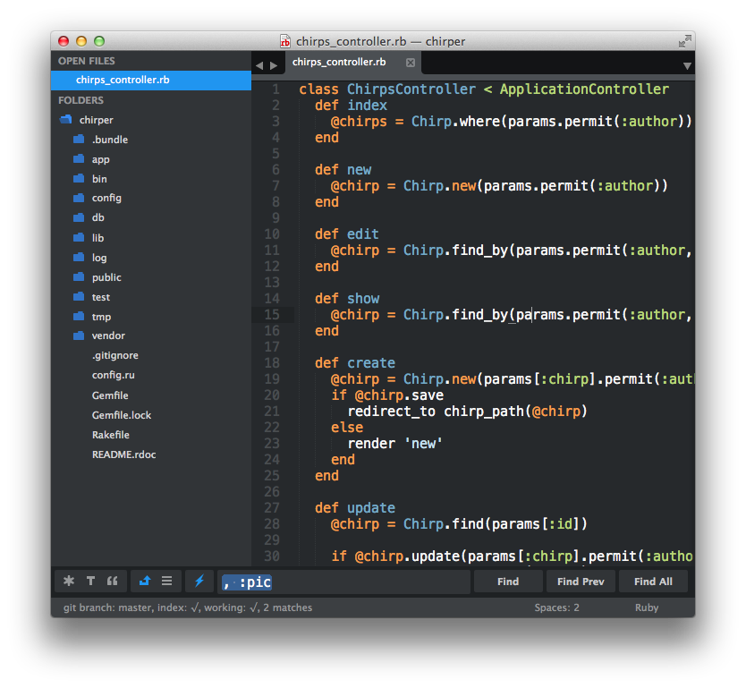
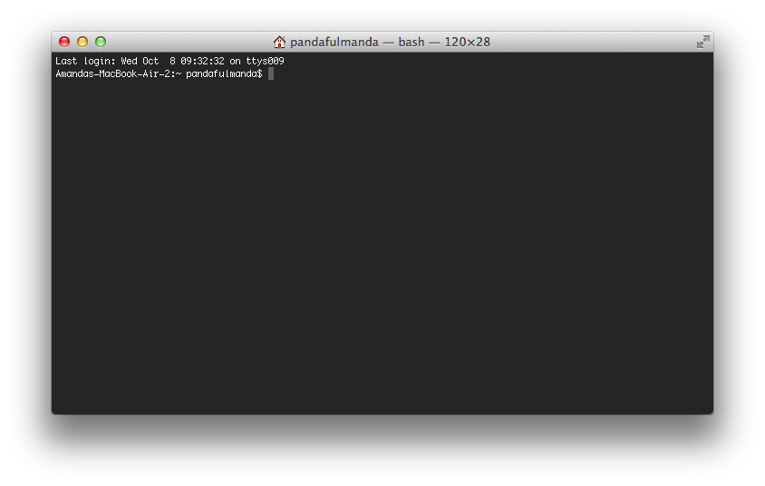
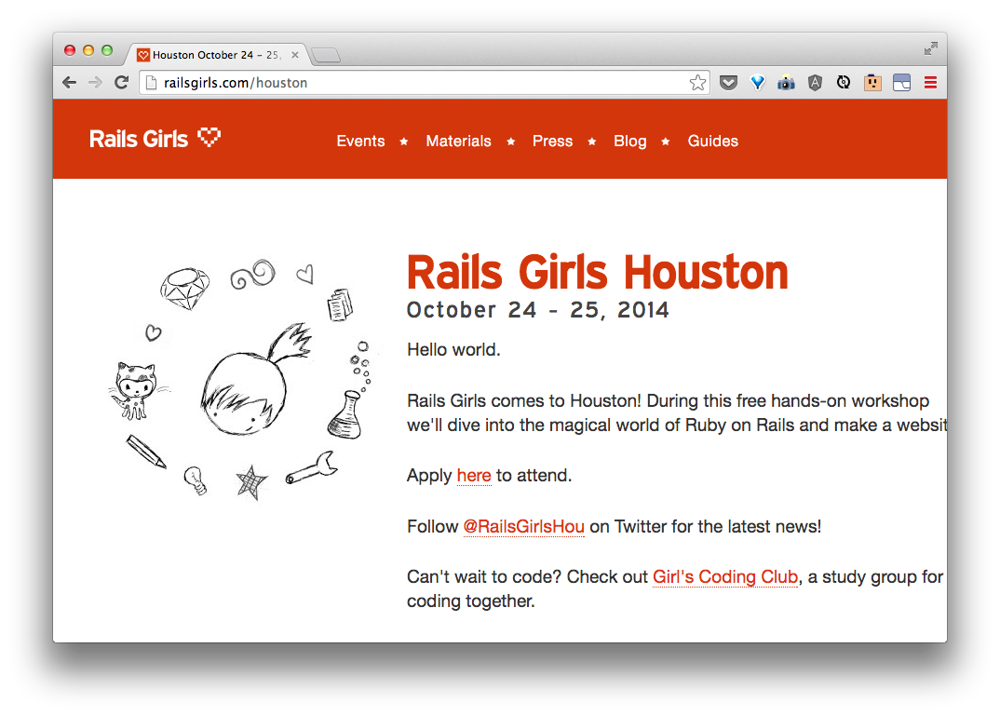

# Let's meet our tools

> Ask your coach to tell you more about these tools =).

## Sublime Text
*This is a text editor. This is where we will code our site.*


## The command prompt
*This is where we will tell Rails to do stuff for us, like start a new project, or run our website!*

This little window can seem intimidating, but with practice you will get the hang of it and feel its power =).

Let's try a couple things to get started:

*Mac*




See the dollar sign? That's called the command prompt. This is where you type in commands as you see them in the code blocks. Note, you don't have to type the $, because it's already there, waiting for your commands!

*Windows*


```bash
$ cd ~
$ mkdir web-projects
$ cd web-projects
```

> What did we just do?  Let's discuss with your coach.


## Chrome
*This is where we get to look at our site as we are building it!*


