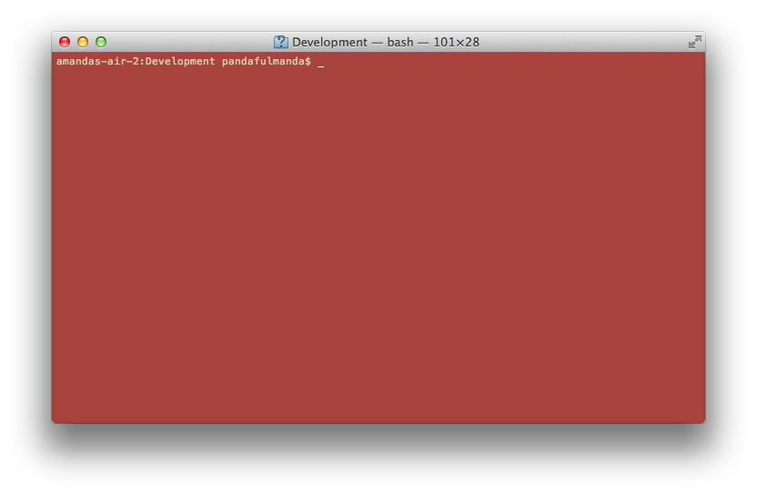

# Let's meet our tools

> Ask your coach to tell you more about these tools =).

## Sublime Text
*This is where we will code our site.*

## The command line
*This is where we will tell Rails to do stuff for us, like start a new project, or run our website!*

This little window can seem intimitating, but with practice, you will get the hang of it and feel its power =).

Let's try a couple things to get started:

*Mac*




*Windows*


```bash
$ cd ~
$ mkdir web-projects
$ cd web-projects
```

> What did we just do?  Let's discuss with your coach.


## Rails
*Rails is used a lot to build sites quickly.*


## Chrome
*This is where we get to look at our site as we are building it!*

