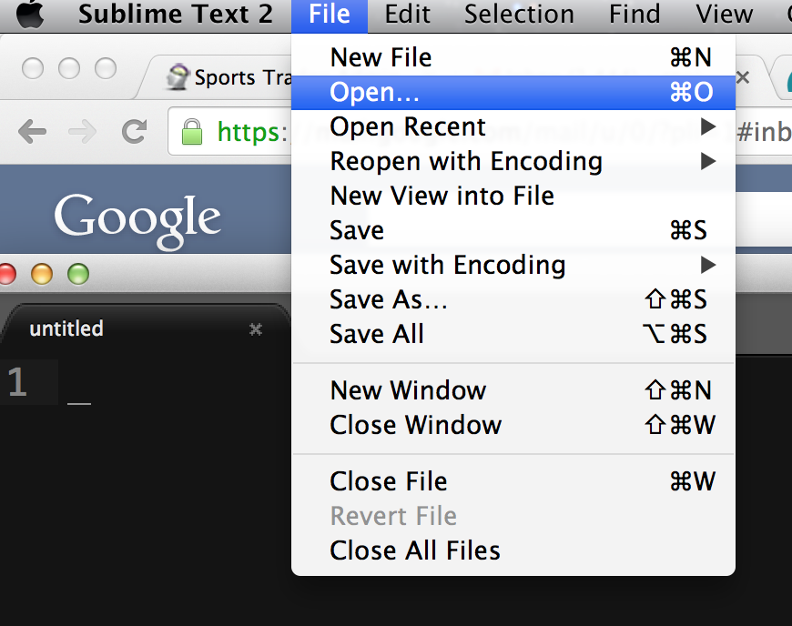
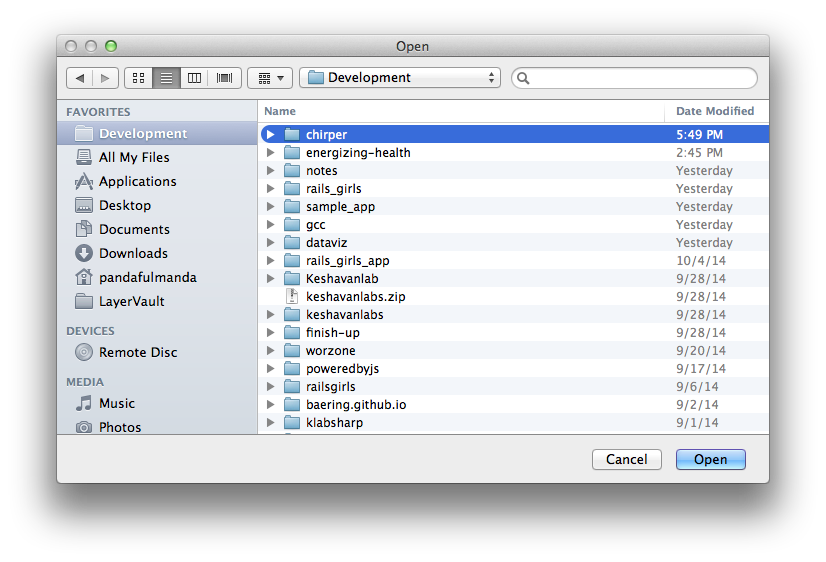
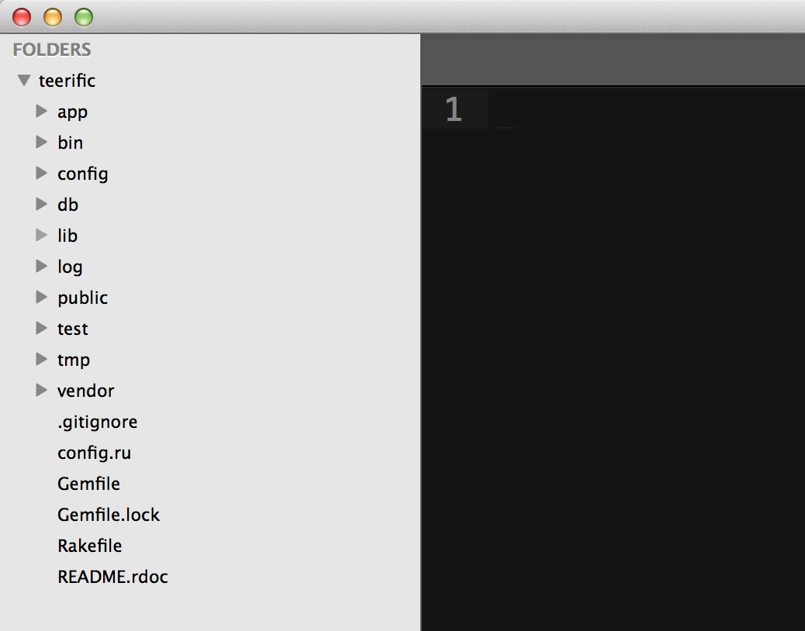
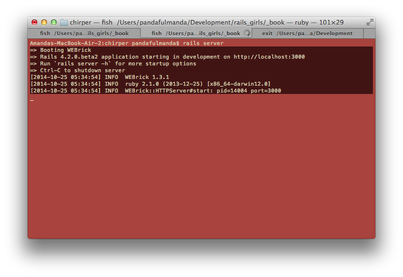
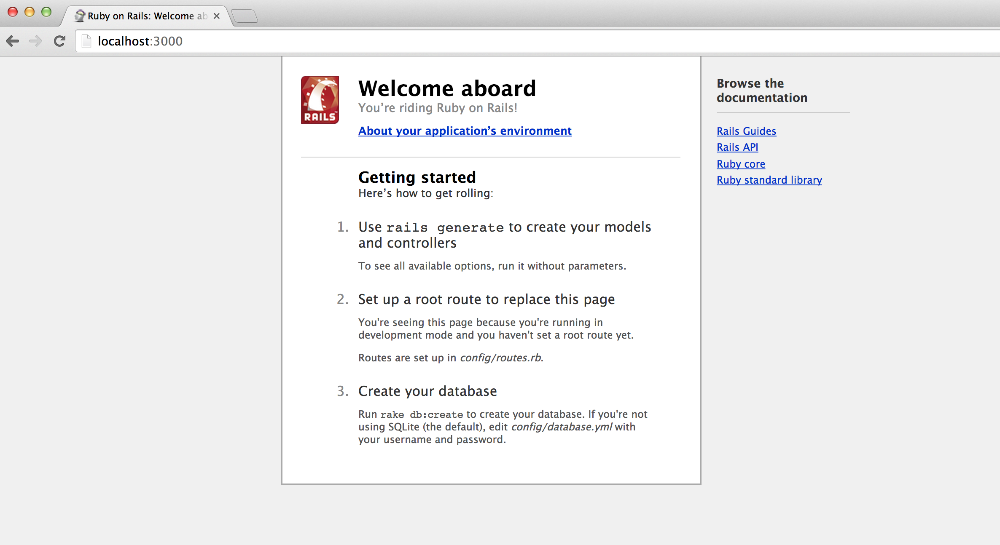

# Getting Started

Let's start by telling Rails to make our first application.  Since we are making a Twitter clone, let's call our application chirper.

## Creating your Rails Applications

At the command prompt, we need to type the command:

```bash
$ rails new chirper
```

The command will generate all the files and folders you need for a Rails application. We will learn more about what the files do as we build our site.

## Opening the project in Sublime

Before we start the application, let's view the project in Sublime.

First we will click on File and then select Open.



Next, we will find the folder we just created.



After we open the folder, we can see our Rails project structure in Sublime's project window.



## Starting our Rails Application

Time to start our Rails Application. Basically, we want to do a quick test to see if we did everything right. :)

~~~
$ cd chirper
$ rails server
~~~

You should see something like the following in your terminal.



If you go to a web browser like Chrome, you can view your website at [http://localhost:3000](http://localhost:3000).



You will be greeted by your front page.

## You've started a brand new rails project!

Let's update this front page and make it our own.
