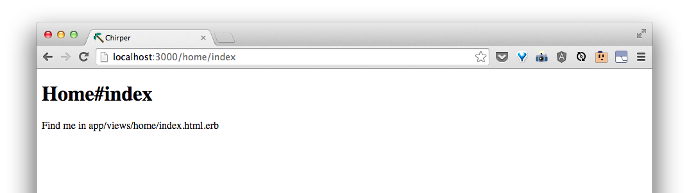

# Change the front page

Let's tell Rails to make an index page at our home for us.  Before we can tell the commandline to do something new, we have to tell it quit what it's currently doing (running the server) by pressing `Ctrl + c`.

Then, we can tell it to make something:

```bash
$ rails generate controller home index
```

Sometimes, Rails will help us if we did something that doesn't work quite yet.  In this case, we may see something like this:


Let's do what it's telling us to do and type:

```bash
$ bundle install
```

Then, the commandline will say something like:


This means it is looking up for some packages called `gems` to download to our `chirper` folder so that we can use them! This might take awhile.

> Ask your coach what `gems` are while you're waiting.


## Make the page

When it's done, we'll see the `$ ` again.  If we press the up arrow, it will show us the last command we ran.  If we press up again, we should see:

```bash
$ rails generate controller home index
```

This time, Rails should know how to make the `controller`.

We should see something like this:


This means that Rails made some files for us!  Let's have a look in Sublime Text. If we open `app/controllers/home_controller.rb`, we should see:


Great!  Let's refresh our page in Chrome.


It looks like we've forgotten something.  We have to do`rails server` again so that there will be a page at this address. This can get annoying if we have to do keep starting the server and quitting the server to see changes.  So let's open a new terminal tab by pressing `cmd + t`.

Now do:

```bash
$ rails server
```
Now if we switch back to our first tab by clicking on it, we can run commands in this first tab while the server is still running.

Let's look at our page in Chrome again. It doesn't look like anything has changed from before.  That's because Rails doesn't know to point the index page to the new one we made.

In Sublime Text, go to `config/routes.rb`.  We should see something like this:


After this following line:

```ruby
    get 'home/index'
```

type:

```ruby
    root to: 'home#index'
```

This will tell Rails to point the `root` of the site to the page we told Rails to make.

Now, if we go to Chrome and refresh, we should see something like:


Note that if we go to http://localhost:3000/home/index, we will see the same thing:



That is what the line:
```ruby
    get 'home/index'
```
helps define.

## Edit the page

Let's go find the file in `app/views/home/index.html.erb` like the page says!


That looks a lot like what's in the browser!  This is `html` with a touch of something called `erb`.  We can see that in the extension of the file, `.html.erb`.

> Ask your coach about `html` and `erb`.

> Go ahead and play around with the file.  Ask your coach for some different things to try. Refresh your page in Chrome to see it update.

For now, this is what I will do.

```html
<h1>Chirper</h1>
<p>This is Chirper, a fun way to post short messages on the web!</p>
```

My page at http://localhost:3000/ now looks like this:


<!--For fun, let's see if we can tell a new route [http://localhost:3000/nest](http://localhost:3000/nest) to that same page.-->
