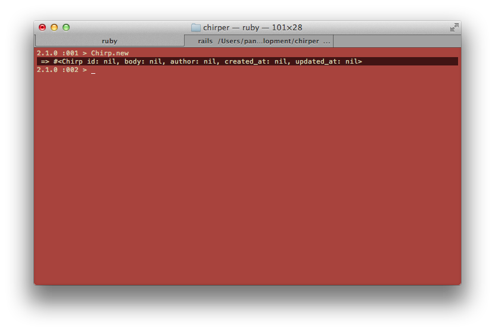
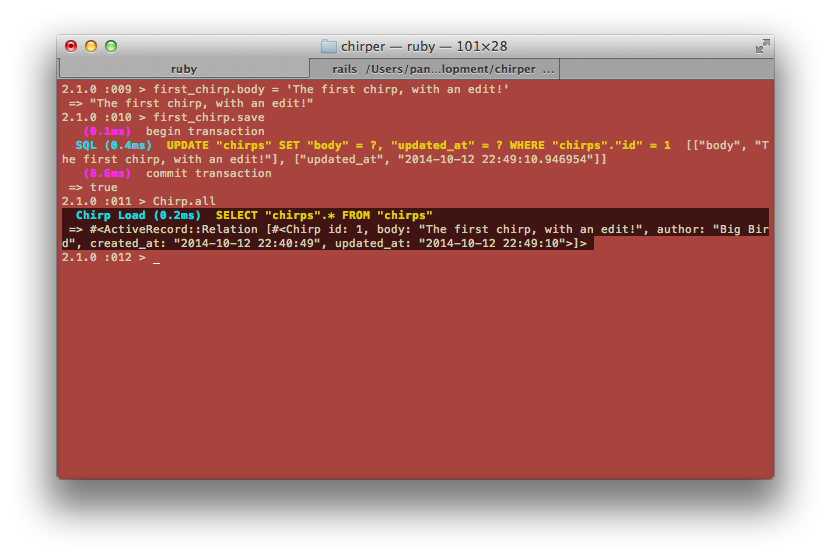

# What should we be able to do with a Chirp?

> Let's discuss!  For example, we need to be able to make new ones.

## Let's try doing some of these things!

As we discussed, we should be able to **create** a new Chirp, **show** a Chirp, **update** a Chirp, **delete** a Chirp, and **list** all our Chirps.  Rails has a way for us to do these things in the commandline.  It's called the `rails console`.   Let's go to the commandline and try:

```bash
$ rails console
```

> Ask your coach what the Rails console is.

We should see:


The `>` means that the Rails console is waiting for us to tell it things to do.

Let's try a couple things:

```rb
> Chirp.new
```

Take note of the highlighted line:



Here, we can see the `body` and `author` properties that we told Rails about earlier, along with an `id`, a `created_at`, and a `updated_at`.  These will come in very handy later on.

Next, let's making a new Chirp that has a `body` and an `author`.

```rb
> first_chirp = Chirp.new(body: 'the first chirp', author: 'Big Bird')
> first_chirp.save
```

This will make a new chirp and also save it to the database.  The `Rails console` nicely tells us that a transaction with the database has happened.


Let's try the following:

```rb
> first_chirp.body
> first_chirp.create_at
> first_chirp.id
```

Each of these let us look at what's at each attribute.

With the id, we can look at the chirp with:

```rb
> Chirp.find(1)
```

We can update the `body` with:

```rb
> first_chirp.find(id).update(body: 'The first chirp, with an edit!')
```

Let's look at all the chirps we have in our table:

```rb
> Chirp.all
```

The commandline shows us the updated chirp!




Let's make some more chirps using a shortcut function that will make a new chirp and save it at once:

```rb
> Chirp.create(body: 'Worm', author: 'The Early Bird')
> Chirp.create(body: 'Hello!', author: 'Big Bird')
> Chirp.create(body: 'I am yellow', author: 'Big Bird')
> Chirp.create(body: 'And it was all yellow', author: 'Coldplay')
> Chirp.create(body: 'bird, bird, bird', author: 'Word')
```

Looking at all chirps using `Chirp.all` again, we can see that there are many more chirps!

Some other things to try:

```rb
> Chirp.find(2)
```

```rb
> Chirp.find(1).destroy
> Chirp.all
```

```rb
> Chirp.where()
```

```rb
> Chirp.where(author: 'Big Bird')
```

```rb
> Chirp.find_by(author: 'Big Bird')
```
<!-- TODO: add link to things to try-->


| Code | Effect (*Describe what each did below or with your coach*) |
| -- | -- |
| `Chirp.all` |           |
| `Chirp.new` |           |
| `Chirp.new(parameters)` |           |
| `Chirp.find(id)` |           |
| `Chirp.find(id).update(parameters)` |           |
| `Chirp.create(parameters)` |           |
| `Chirp.find(id).destroy` |           |
| `Chirp.where(parameters)` |           |
| `Chirp.find_by(parameters)` |           .|

> Talk through these different things with your coach.  Ask your coach, what else [could we try](http://guides.rubyonrails.org/active_record_basics.html)?
>
> Note especially the differences between `find`, `where`, and `find_by`.
