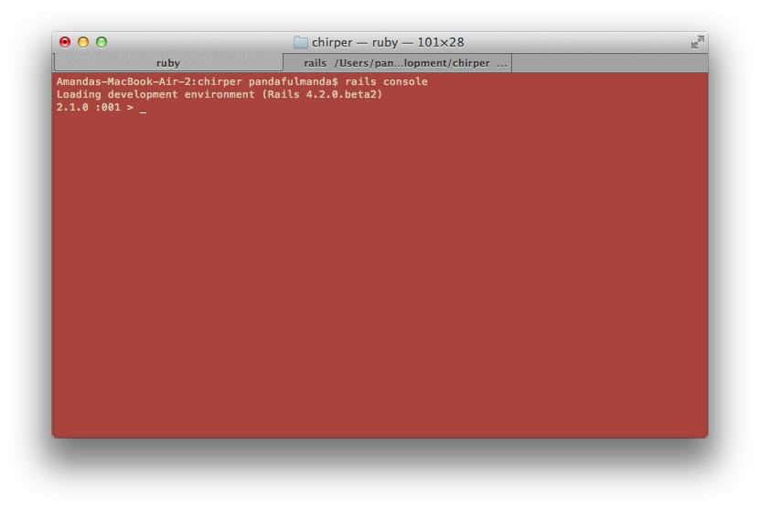
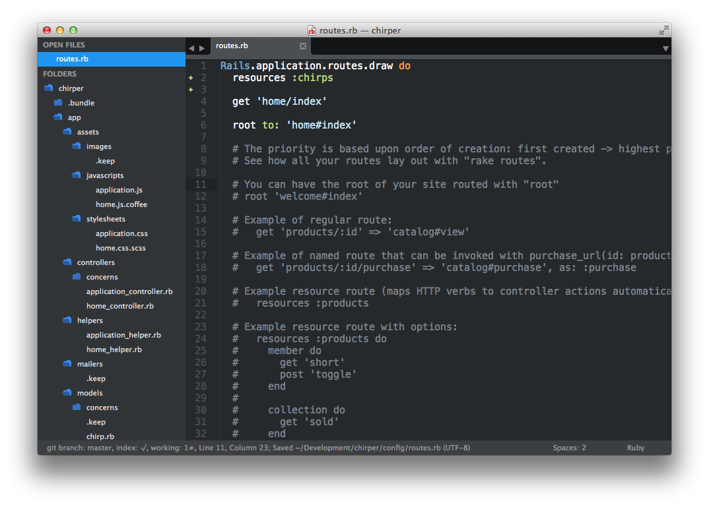
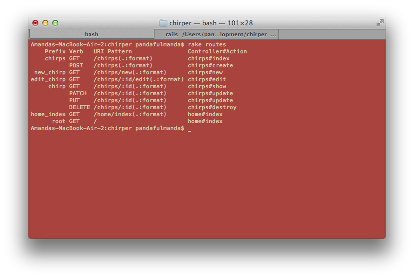
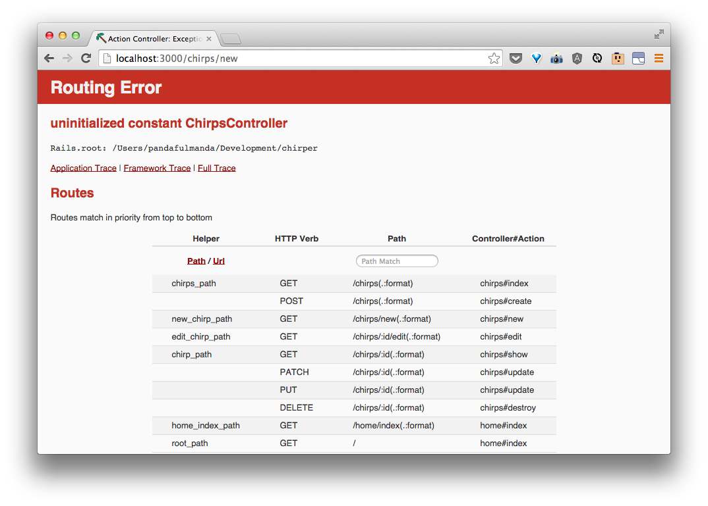
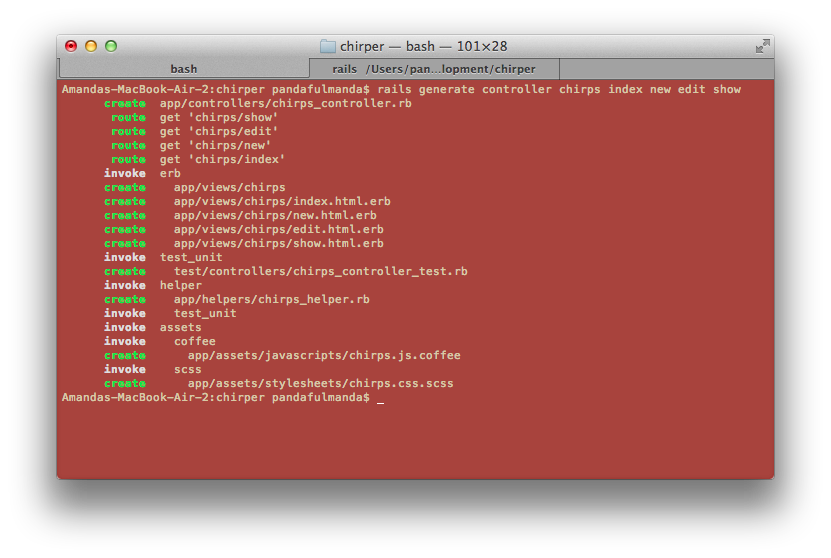
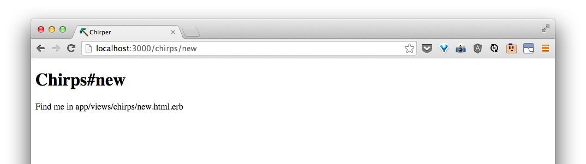
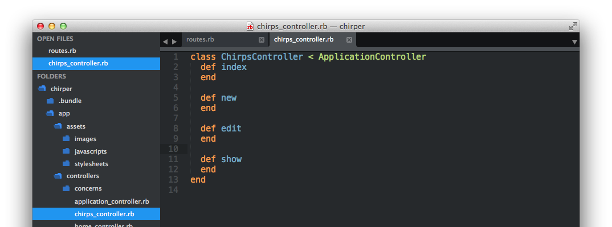

# What should we be able to do with a Chirp?

> Let's discuss!  For example, we need to be able to make new ones.

## Let's try doing some of these things!

As we discussed, we should be able to **create** a new Chirp, **show** a Chirp, **update** a Chirp, **delete** a Chirp, and **list** all our Chirps.  Rails has a way for us to do these things in the commandline.  It's called the `rails console`.   Let's go to the commandline and try:

```bash
$ rails console
```

> Ask your coach what is the Rails console.

We should see:



The `>` means that the Rails console is waiting for us to tell it things to do.

Let's try a couple things:

```rb
> Chirp.new
```

Take note of the highlighted line:


Here, we can see the `body` and `author` properties that we told Rails about earlier, along with an `id`, a `created_at`, and a `updated_at`.  These will come in very handy later on.

Next, let's making a new Chirp that has a `body` and an `author`.

```rb
> first_chirp = Chirp.new(body: 'the first chirp', author: 'Big Bird')
> first_chirp.save
```

This will make a new chirp and also save it to the database.  The `Rails console` nicely tells us that a transaction with the database has happened.


Let's try the following:

```rb
> first_chirp.body
> first_chirp.create_at
> first_chirp.id
```

Each of these let us look at what's at each attribute.

With the id, we can look at the chirp with:

```rb
> Chirp.find(1)
```

We can update the `body` with:

```rb
> first_chirp.find(id).update(body: 'The first chirp, with an edit!')
```

Let's look at all the chirps we have in our table:

```rb
> Chirp.all
```

The commandline shows us the updated chirp!


Let's make some more chirps using a shortcut function that will make a new chirp and save it at once:

```rb
> Chirp.create(body: 'Worm', author: 'The Early Bird')
> Chirp.create(body: 'Hello!', author: 'Big Bird')
> Chirp.create(body: 'I am yellow', author: 'Big Bird')
> Chirp.create(body: 'And it was all yellow', author: 'Coldplay')
> Chirp.create(body: 'bird, bird, bird', author: 'Word')
```

Looking at all chirps using `Chirp.all` again, we can see that there are many more chirps!

Some other things to try:

```rb
> Chirp.find(2)
```

```rb
> Chirp.find(1).destroy
> Chirp.all
```

```rb
> Chirp.where(author: 'Big Bird')
```
<!-- TODO: add link to things to try-->

> Talk through these different things with your coach.  See what else you can try here:
>
> What could we do?

## Let's add pages for the things that we can do.

Doing these things on the commandline is super fun and all, but if we want users to be able to do what we did with Chirps, we will need to map these capabilities to some pages.

The ability to:
* create a new thing,
* list all of those things,
* show a specific thing,
* update a specific thing, and
* delete a thing

are very common and Rails has a way for us to start setting these up quickly.

We can start by adding routes in the `config/routes.rb`.  In that file, let's add that in a new line right after `do`:

```rb
resources :chirps
```

`config/routes.rb` should now look something like this:



This is a shortcut to make routes for doing things with a '`resource`' really quickly.

If we reload our page, we see that it's still running.  So what has this `resources` thing done for us?  We can find out by going back to the commandline and asking Rails:

```bash
$ rake routes
```

We should see:



> Let's talk about what routes are and what this idea of a resource is.
>
> What does each of these "actions" mean?  What should each do?


We can line up what we saw from `rake routes` for chirps with what we did in the console like so:

| URI Pattern | Controller#Action | What should it do? | Example action code |
| -- | -- | -- | -- |
| /chirps(.:format) | **chirps#index** | Show a list of all the chirps on the page | `Chirp.all` |
| /chirps(.:format) | chirps#create | Create a new chirp that get's saved | `Chirp.create(body: 'a body', author: 'some author')` |
| /chirps/new(.:format) | **chirps#new** | Show a form on a page for someone to fill out a new chirp | `Chirp.new` |
| /chirps/:id/edit(.:format) | **chirps#edit** | Show a form for editing an existing chirp | `Chirp.find(id)` |
| /chirps/:id(.:format) | **chirps#show** | Show an existing chirp |  `Chirp.find(id)` |
| /chirps/:id(.:format) | chirps#update | Update a specific chirp based based on input from the form  | `Chirp.find(id).update(body: 'a body')` |
| /chirps/:id(.:format) | chirps#update | *same as previous* | `Chirp.find(id).update(body: 'a body')` |
| /chirps/:id(.:format) | chirps#destroy | delete a specific chirp | `Chirp.find(id).destroy` |


The bolded ones are the pages we will be starting with.

Let's see what happens when we try to go to one of these routes, namely [/chirps](http://localhost:3000/chirps).

<!-- TODO: change this out for chirps index -->


We can tell Rails to make a controller like we did before, with a few extra "`actions`".

```bash
$ rails generate controller chirps index new edit show
```

The terminal should tell you that it's made some files, like last time:




> Why generate the *chirps* controller with actions `index`, `new`, `edit`, and `show`?
>
> Rails will help set up the pages for these actions as well.  If you look at the `rake routes` table, these actions (chirps#*index*, chirps#*new*, chirps#*edit*, and chirps#*show*) all have the verb 'GET'.  'GET' is the way we get pages automatically when we type the web address in the browser.  This means these are the pages what will have some HTML content to them, just like the front-page.

<!-- Was going to put something here about deleted the freshly created routes since they are redundant, but perhaps this is not needed. -->

Now, if we try going to [/chirps](http://localhost:3000/chirps) again, we should see:
<!-- TODO: change this out for chirps index -->



In `app/controllers/chirps_controller.rb`, we see:


