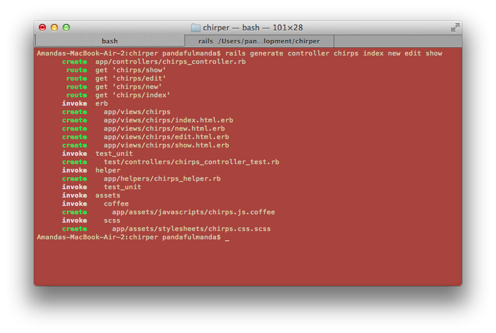

## Let's add pages for the things that we can do.

Doing these things on the commandline is super fun and all, but if we want users to be able to do what we did with Chirps, we need to map these abilities to some pages.

The ability to:
* create a new thing,
* list all of those things,
* show a specific thing,
* update a specific thing, and
* delete a thing

are all very common and Rails has a way for us to start setting these up quickly.

We can start by adding routes in the `config/routes.rb`.  In that file, let's add in a new line right after `do`:

```rb
resources :chirps
```

`config/routes.rb` should now look something like this:


This is a shortcut to make routes for doing things with a `resource` really quickly.

If we reload our page, we see that it's still running.  So what has this `resources` thing done for us?  We can find out by going back to the commandline and asking Rails to:

```bash
$ rake routes
```

We should see:


> Let's talk about what routes are and what this idea of a resource is.
>
> What do each of these "actions" mean?  What should each do?

We can match up what we saw from `rake routes` with what we did previously in the console:

| URI Pattern | Controller#Action | What should it do? | Example action code |
| -- | -- | -- | -- |
| /chirps(.:format) | **chirps#index** | Show a list of all the chirps on the page | `Chirp.all` |
| /chirps(.:format) | chirps#create | Create a new chirp that get's saved | `Chirp.create(body: 'a body', author: 'some author')` |
| /chirps/new(.:format) | **chirps#new** | Show a form on a page for someone to fill out a new chirp | `Chirp.new` |
| /chirps/:id/edit(.:format) | **chirps#edit** | Show a form for editing an existing chirp | `Chirp.find(id)` |
| /chirps/:id(.:format) | **chirps#show** | Show an existing chirp |  `Chirp.find(id)` |
| /chirps/:id(.:format) | chirps#update | Update a specific chirp based based on input from the form  | `Chirp.find(id).update(body: 'a body')` |
| /chirps/:id(.:format) | chirps#update | *same as previous* | `Chirp.find(id).update(body: 'a body')` |
| /chirps/:id(.:format) | chirps#destroy | delete a specific chirp | `Chirp.find(id).destroy` |


The bolded terms in the table above are the pages we will start with.

Let's see what happens when we try to go to one of these routes, namely [http://localhost:3000/chirps](http://localhost:3000/chirps).

<!-- TODO: change this out for chirps index -->


We can tell Rails to make a controller like we did before, with a few extra "`actions`".

```bash
$ rails generate controller chirps index new edit show
```

The terminal should tell you that it's made some files, like last time:




> Why generate the *chirps* controller with actions `index`, `new`, `edit`, and `show`?
>
> When we do it this way, Rails will help set up the pages for these actions as well.  If you look at the `rake routes` table, these actions (chirps#*index*, chirps#*new*, chirps#*edit*, and chirps#*show*) all have the verb 'GET'.  'GET' is the way we get pages automatically when we type the web address in the browser.  This means these are the pages what will have some HTML content to them, just like the front-page.

<!-- Was going to put something here about deleted the freshly created routes since they are redundant, but perhaps this is not needed. -->

Now, if we try going to [http://localhost:3000/chirps](http://localhost:3000/chirps) again, we should see:
<!-- TODO: change this out for chirps index -->


In `app/controllers/chirps_controller.rb`, we see:


