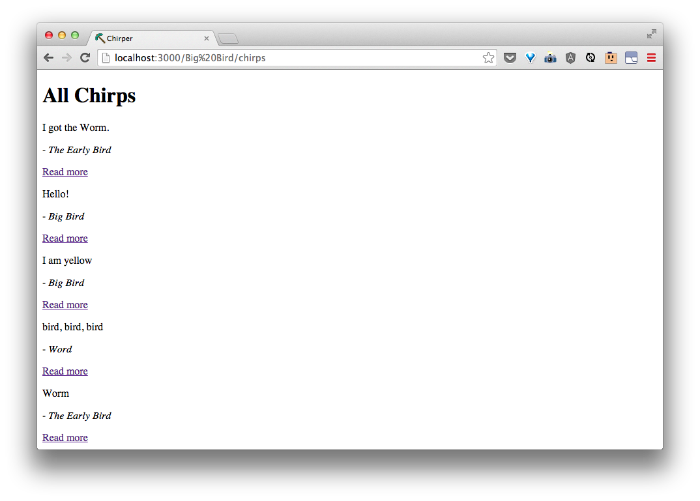

#Showing Chirps by Author

> What we have so far is pretty neat, but we could make it act a little more like Twitter.
>
> What might the routes for showing chirps by author look like?  Look at Twitter's routes and discuss.

Rails has a neat way for us to make a set of routes with prefixes in front.  This would be a quick way for us to make a set of routes about one author's chirps.

In our `config/routes.rb`, let's put the following after `resources :chirps`:

```rb
  scope ':author', as: 'author' do
    resources :chirps
  end
```


If we look at the routes for this using `rake routes` in our commandline, we will get:


The ones starting with `:author` are the ones we just made!  Let's skip **creating**, **updating**, and **destroying** chirps by adding `, except: ['create', 'update', 'destroy']` to what we just coded like so:


Now, if we `rake routes` again, we get:


As with `:id` before, we will now get the `:author` value in our controllers through the route. If we go to [http://localhost:3000/Big Bird/chirps](http://localhost:3000/Big%20Bird/chirps) right now, we still all chirps.



That's because our actions don't know to do anything different yet with the author.

We can line up our author routes as before:

| URI Pattern | Controller #Action | What-should-it-do? | Example action code |
| -- | -- | -- | -- |
| /:author/chirps | **chirps#index** | Show a list of all chirps by author | `Chirp.where(author: 'some author')` |
| /:author/chirps/new | **chirps#new** | Show a form for a new chirp with the author filled out | `Chirp.new(author: 'some author')` |
| /:author/chirps/:id/edit | **chirps#edit** | Show a form for editing an existing chirp from an author | `Chirp.find_by(author: 'some author', id: 'id')` |
| /:author/chirps/:id | **chirps#show** | Show a chirp from an author | `Chirp.find_by(author: 'some author', id: 'id')` |

Let's try listing all chirps by one author!
