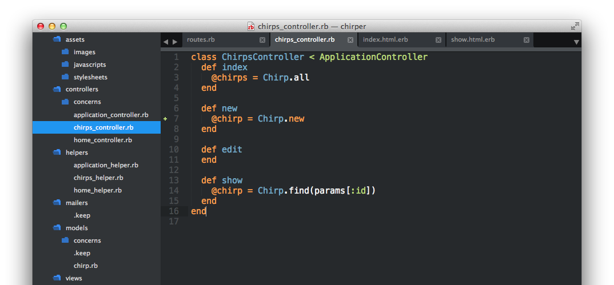
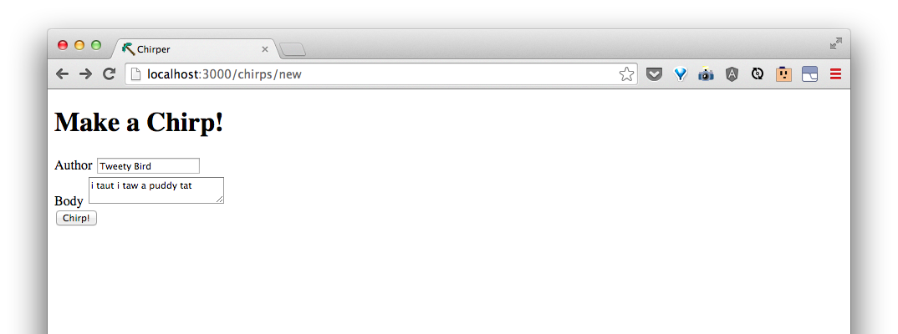
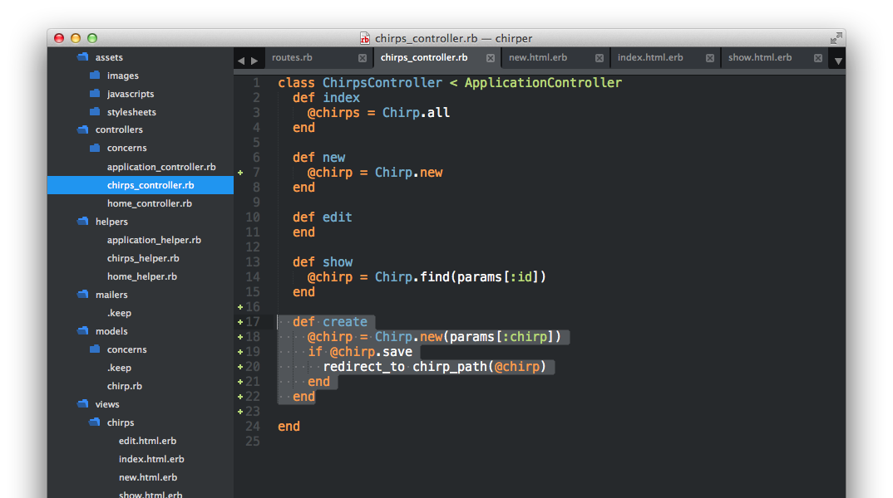

# Add a new chirp

| URI Pattern | Controller#Action | What should it do? | Example action code |
| -- | -- | -- | -- |
| /chirps/new(.:format) | **chirps#new** | Show a form on a page for someone to fill out a new chirp | `Chirp.new` |
| /chirps(.:format) | chirps#create | Create a new chirp that get's saved | `Chirp.create(body: 'a body', author: 'some author')` |

We'll start by making a form on  [/chirps/new](http://localhost:3000/chirps/new).  In the `new` action/function in  `app/controllers/chirps_controller.rb`, we will add:

```rb
    @chirp = Chirp.new
```


And in `app/views/chirps/new.html.erb`, let's make a form:

```html
<h1>Make a Chirp</h1>

<%= form_for @chirp do |f| %>

  <div>
    <%= f.label :author %>
    <%= f.text_field :author %>
  </div>

  <div>
    <%= f.label :body %>
    <%= f.text_area :body %>
  </div>

  <div>
    <%= f.submit 'Chirp!' %>
  </div>

<% end %>
```

Now, if we go to [/chirps/new](http://localhost:3000/chirps/new), we'll see a form for making a new chirp!


Let's try to chirp by filling out the form and press "Chirp!"




> What happened?  Discuss with the coach and look at the code the `form_for` function made for us in our HTML using Inspect Element.

Since submitting the form goes to the **chirps#create** controller action, the **chirps#create** should take the parameters that the form submits a make a new chirp with that.

Let's add the following to our `app/controllers/chirps_controller.rb`:

```rb
  def create
    @chirp = Chirp.new(params[:chirp].permit(:author, :body))
    if @chirp.save
      redirect_to chirp_path(@chirp)
    else
      render 'new'
    end
  end
```
Our controller should now look like this:

<!-- TODO: update this create to include the else. -->


Now, when we submit...


we get redirected to the new chirp.

> Review with your coach.  What did we do?
