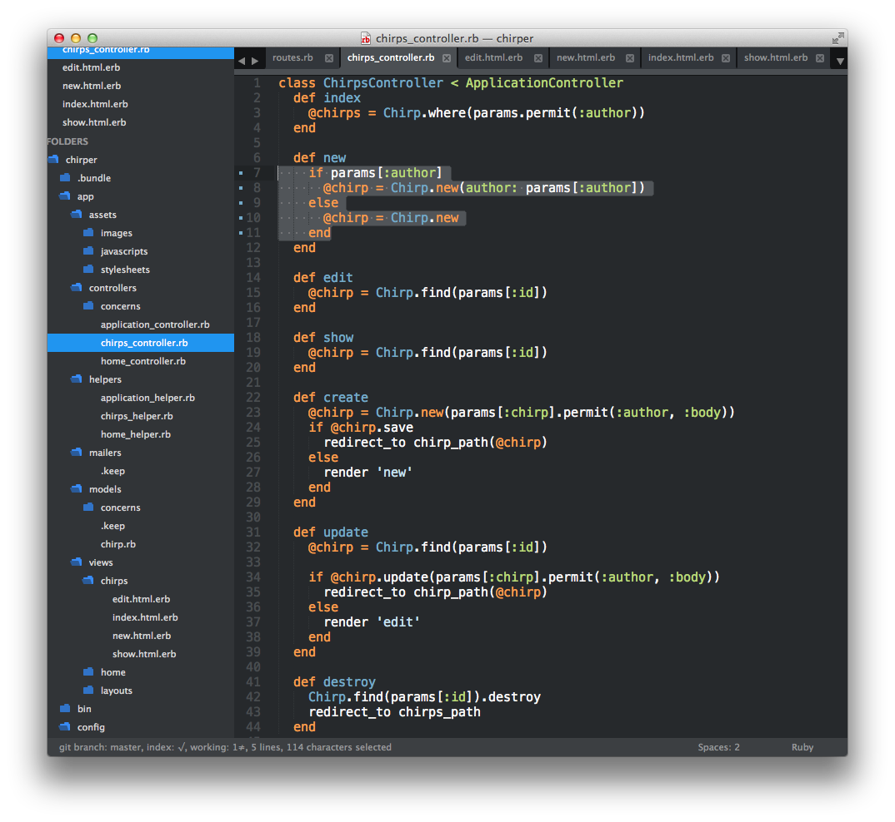
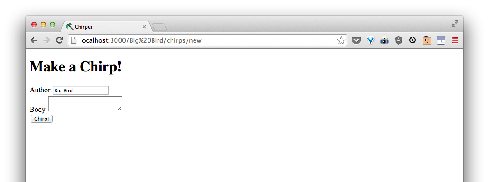
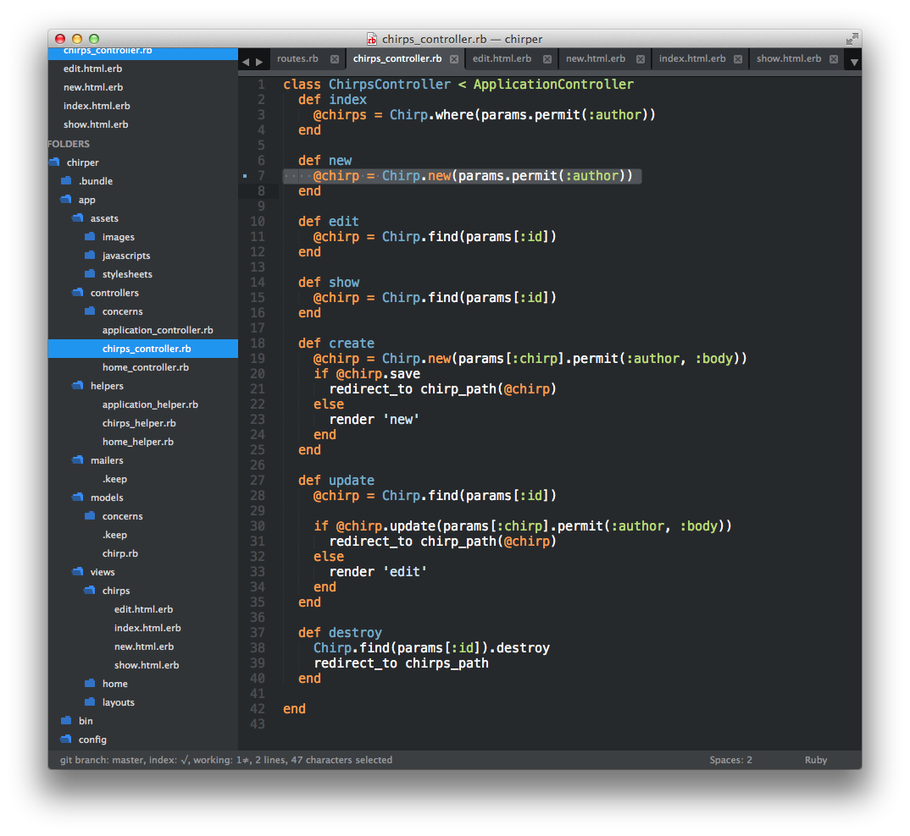

# Add new chirp by author

| URI Pattern | Controller #Action | What-should-it-do? | Example action code |
| -- | -- | -- | -- |
| /:author/chirps/new | **chirps#new** | Show a form for a new chirp with the author filled out | `Chirp.new(author: 'some author')` |

One way to change the code for the **chirps#new** action in `app/controllers/chirps_controller.rb` is to write it like this:

```rb
  def new
    if params[:author]
      @chirp = Chirp.new(author: params[:author])
    else
      @chirp = Chirp.new
    end
  end
```




We can see that this works when we go to [http://localhost:3000/Big Bird/chirps/new](http://localhost:3000/Big%20Bird/chirps/new):



But as before, we know we can do better:

```rb
  def new
    @chirp = Chirp.new(params.permit(:author))
  end
```



Try chirping as Big Bird!

> We didn't make any changes to the **chirps#create** action.  Why does create a chirp still work?
