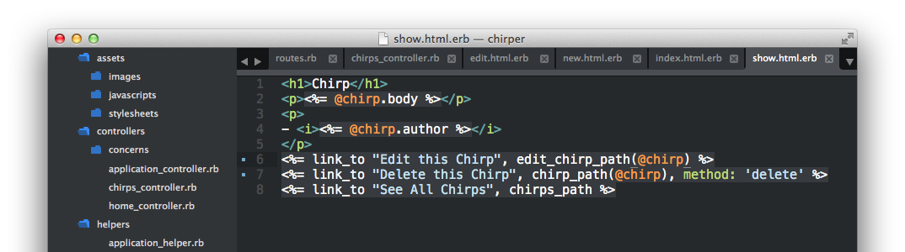

# Deleting a chirp

| Verb | URI Pattern | Controller #Action | What-should-it-do? | Example action code |
| -- | -- | -- | -- | -- |
| DELETE | /chirps/:id | chirps#destroy | delete a specific chirp | `Chirp.find(id).destroy` |

As you may have guessed, deleting will happen in the **chirps#destroy** action.  Let's add the action to our `app/controllers/chirps_controller.rb`:

```rb
  def destroy
    Chirp.find(params[:id]).destroy
    redirect_to chirps_path
  end
```

Notice in the verb column for this route, we have the word `DELETE`.  This is a special type of method that we'll use to delete a chirp.  Let's put a link in our `app/views/chirps/show.html.erb` for deleting a chirp:

```html
<%= link_to "Delete this Chirp", chirp_path(@chirp), method: 'delete' %>
```



Now, if we go to [this chirp at http://localhost:3000/chirps/5](http://localhost:3000/chirps/5) and click "Delete this Chirp," we will be redirected to a new list of chirps with that chirp removed.

> Ask your coach about the `DELETE` methods and other methods like `GET`, `PUT` and `POST`.
