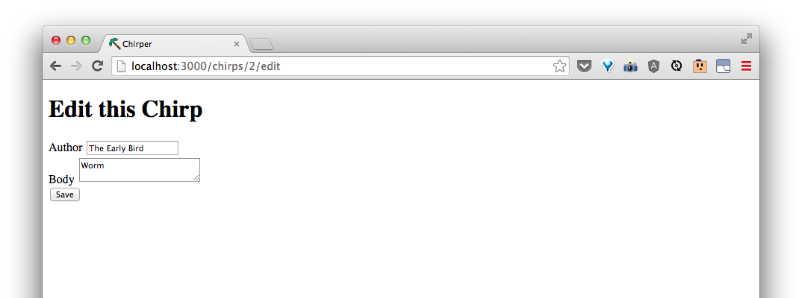
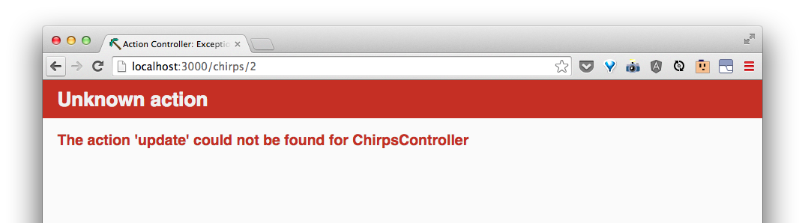

# Edit an existing chirp

What if we want to edit a chirp?

| URI Pattern | Controller#Action | What should it do? | Example action code |
| -- | -- | -- | -- |
| /chirps/:id/edit(.:format) | **chirps#edit** | Show a form for editing an existing chirp | `Chirp.find(id)` |
| /chirps/:id(.:format) | chirps#update | Update a specific chirp based based on input from the form  | `Chirp.find(id).update(body: 'a body')` |

As with showing a specific chirp, our editing form needs to get the information for a specific Chirp.  We can tell our **chirps#edit** action to do the same thing as our **chirps#show** action by adding this line to the `edit` action:

```rb
    @chirp = Chirp.find(params[:id])
```

Now, our `app/controllers/chirps_controller.rb` show look like this:


And in `app/views/chirps/edit.html.erb`, let's make a form using the existing chirp's information:

```html
<h1>Edit this Chirp</h1>

<%= form_for @chirp do |f| %>

  <div>
    <%= f.label :author %>
    <%= f.text_field :author %>
  </div>

  <div>
    <%= f.label :body %>
    <%= f.text_area :body %>
  </div>

  <div>
    <%= f.submit 'Save' %>
  </div>

<% end %>
```

Now, if we go to the edit page of a chirp, like the one at [http://localhost:3000/chirps/2/edit](http://localhost:3000/chirps/2/edit), we should see something like:



When we try to edit and save, we get an error:




We have to make a **chirps#update** action, one that will find the chirp we're trying to edit and update it. We can make this by adding:

```rb
  def update
    @chirp = Chirp.find(params[:id])

    if @chirp.update(params[:chirp].permit(:author, :body))
      redirect_to chirp_path(@chirp)
    else
      render 'edit'
    end
  end
```

Now, when we make a change and update, we'll see:


Great!  Let's add a link on the show chirp page so we can easily get to the edit page when we want to.  In `app/views/chirps/show.html.erb`, add:

```html
<%= link_to "Edit this Chirp", edit_chirp_path(@chirp) %>
```

Now, when showing a Chirp, [http://localhost:3000/chirps/2](http://localhost:3000/chirps/2) has a link for us to edit the chirp.


> Review with your coach what we did with editing a chirp.
