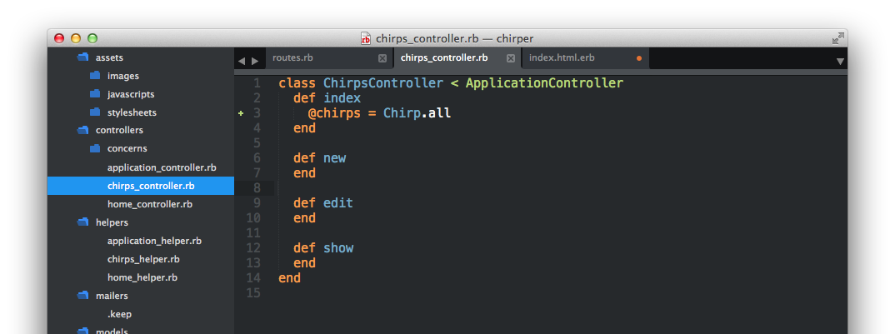
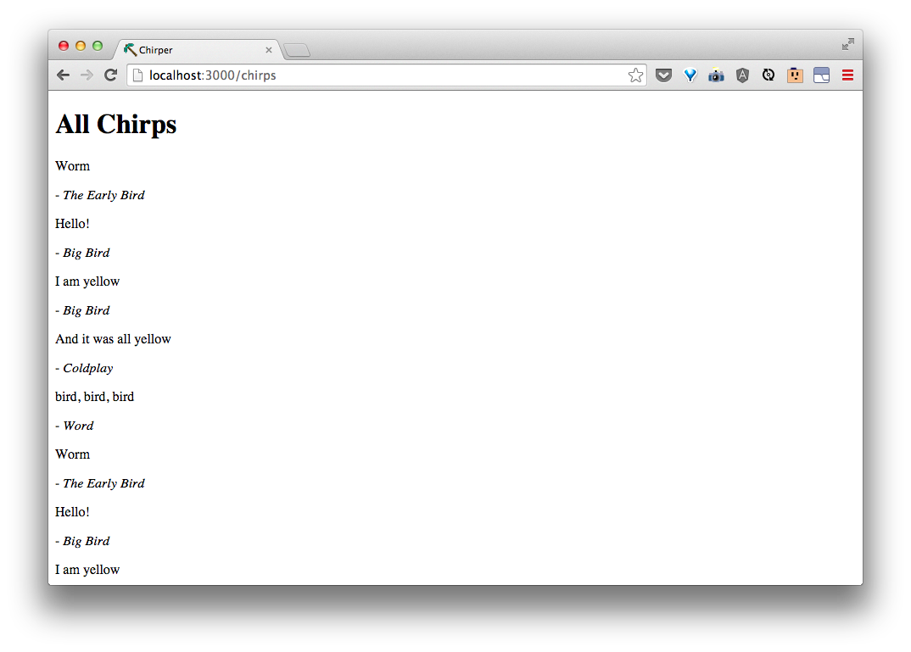

# List all chirps

Let's work on the `index`, where we list all our Chirps for our users.

| URI Pattern | Controller #Action | What-should-it-do? | Example action code |
| -- | -- | -- | -- |
| /chirps | **chirps#index** | Show a list of all the chirps on the page | `Chirp.all` |

In `app/controllers/chirps_controller.rb` in between `def index` and the closet `end`, let's add

```rb
  @chirps = Chirp.all
```
like so:




In the corresponding view --`app/views/chirps/index.html.erb`, let's add this line:

```html
<h1>All Chirps</h1>
<% @chirps.each do |chirp| %>
  <p><%= chirp.body %></p>
  <p>
    - <i><%= chirp.author %></i>
  </p>
<% end -%>
```

Now if we go to [http://localhost:3000/chirps](http://localhost:3000/chirps) again, we'll see:



Pretty nifty!


> Discuss with the coach.  What did we just do?  What did the `controller` do?  What did the `view` do?
