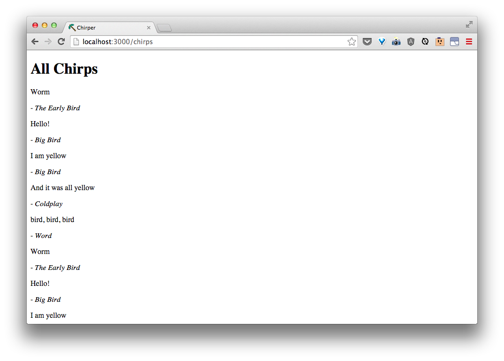
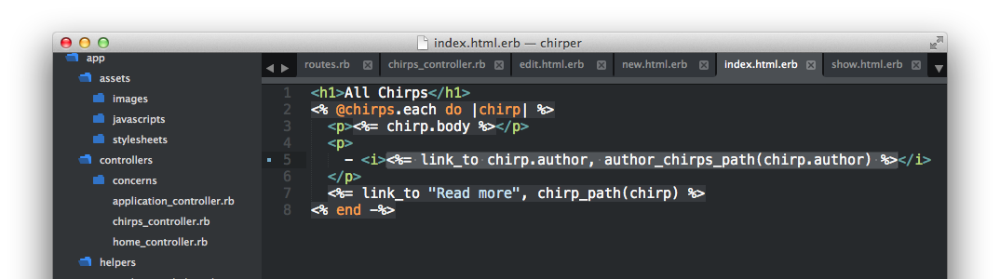

# List chirps by author

| URI Pattern | Controller #Action | What-should-it-do? | Example action code |
| -- | -- | -- | -- |
| /:author/chirps | **chirps#index** | Show a list of all chirps by author | `Chirp.where(author: 'some author')` |

Looking at the **chirps#index** action right now, we need to add a case for when there is an author parameter from the route.  We could do this using `if params[:author]` and writing the code for the special case when there is an author after and putting the `Chirp.all` we have currently in the `else` case:

```rb
  def index
    if params[:author]
      @chirps = Chirp.where(author: params[:author])
    else
      @chirps = Chirp.all
    end
  end
```


Now, if we go to [http://localhost:3000/Big Bird/chirps](http://localhost:3000/Big%20Bird/chirps), we  see only the chirps from Big Bird.


And when we go to [http://localhost:3000/chirps](http://localhost:3000/chirps), we still see all chirps.



We can make our code simpler.  Looking at the `author: params[:author]` part inside the `Chirp.where`, that's really the same as saying `params.permit(:author)`.

In fact, if there are no parameters, Rails will run `Chirp.where` without any parameters, which we saw in the Rails console will give us back all chirps.  This means we can rewrite the **chirps#index** action like so:

```rb
  def index
    @chirps = Chirp.where(params.permit(:author))
  end
```


When we go to [http://localhost:3000/Big Bird/chirps](http://localhost:3000/Big%20Bird/chirps) and [http://localhost:3000/chirps](http://localhost:3000/chirps), we still get the expected chirps.

Let's link each author to their chirps in the listing.  In `app/views/chirps/index.html.erb`, update `<%= chirp.author %>` to `<%= link_to chirp.author, author_chirps_path(chirp.author) %>`:



Now, we see the author linked and can click to see all the author's chirps!


