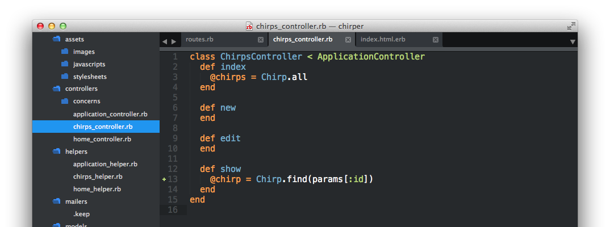
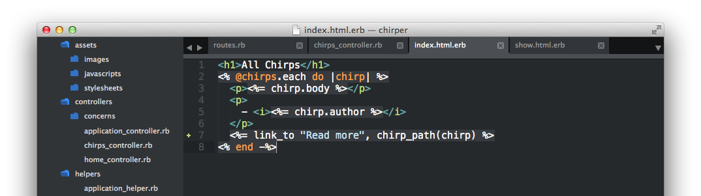

# Show one chirp

| URI Pattern | Controller#Action | What should it do? | Example action code |
| -- | -- | -- | -- |
| /chirps/:id(.:format) | **chirps#show** | Show an existing chirp |  `Chirp.find(id)` |

In the `show` action/function in  `app/controllers/chirps_controller.rb`, let's add

```rb
  @chirp = Chirp.find(params[:id])
```



In the corresponding view --`app/views/chirps/show.html.erb`, put this in:

```html
<h1>Chirp</h1>
<p><%= @chirp.body %></p>
<p>
- <i><%= @chirp.author %></i>
</p>
```

Now if we go to [http://localhost:3000/chirps/2](http://localhost:3000/chirps/2),
we should see one chirp.

> Where does the value for `params[:id]` come from in our `app/controllers/chirps_controller.rb`?

It would nice to able to see the individual chirp just by clicking on a link from the list of all chirps.  Let's go back to `app/views/chirps/index.html.erb` and add:

```html
  <%= link_to "Read more", chirp_path(chirp) %>
```
right before the `<% end -%> of the loop so that `app/views/chirps/index.html.erb` looks like this:



Going to [http://localhost:3000/chirps](http://localhost:3000/chirps) now should show all the chirps, with a link to "Read More" underneath.  Clicking on each link will bring us to a new page with the specific chirp.

We can also add a link back to all chirps in `view` with each of the posts.

In `app/views/chirps/index.html.erb`, add to the bottom:

```html
<%= link_to "See All Chirps", chirps_path %>
```

> What does the [link_to](http://api.rubyonrails.org/classes/ActionView/Helpers/UrlHelper.html) code do for us?  Discuss with the coach and look at the HTML in the browser with Inspect Element.

<!-- TODO: if there is time, include screenshots of doing inspect element.  Otherwise, assume the coach will help them with that. -->

