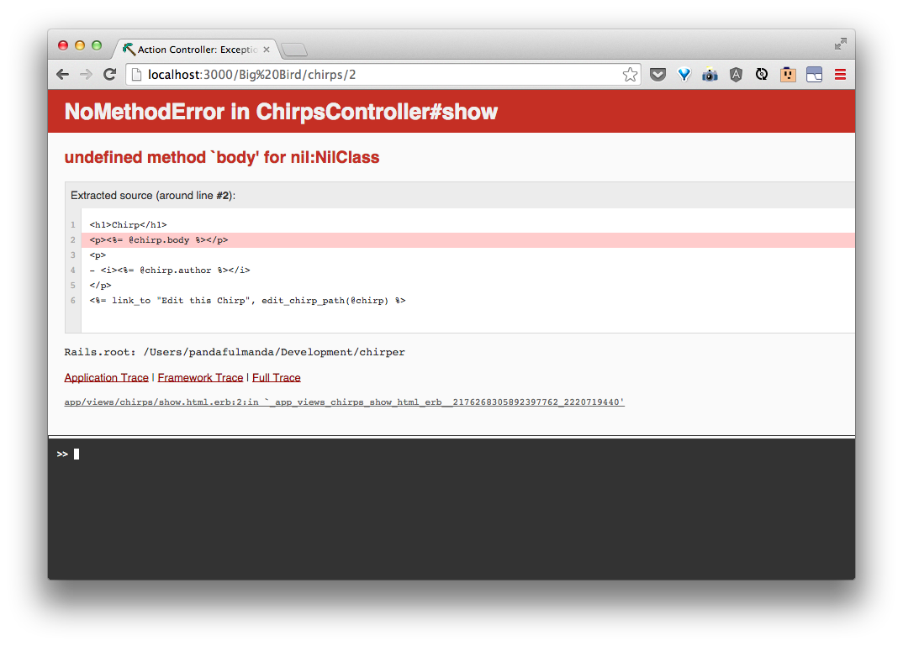

<!-- Not sure we need this section... -->

# Show and edit a chirp by author

The information for showing and editing a chirp will be the same based on the parameters from the route.

| URI Pattern | Controller#Action | What should it do? | Example action code |
| -- | -- | -- | -- |
| /:author/chirps/:id(.:format) | **chirps#show** | Show a chirp from an author | `Chirp.find_by(author: 'some author', id: 'id')` |
| /:author/chirps/:id/edit(.:format) | **chirps#edit** | Show a form for editing an existing chirp from an author | `Chirp.find_by(author: 'some author', id: 'id')` |


Let's update the **chirps#show** and **chirps#edit** actions:

```rb
  def edit
    @chirp = Chirp.find_by(params.permit(:author, :id))
  end

  def show
    @chirp = Chirp.find_by(params.permit(:author, :id))
  end
```


We will see the same things as before for showing and editing a chirp.


But now, if the author did not make the chirp at the given id, we will get an error:




On Twitter, we would see the ['Fail Whale' page](http://www.yiyinglu.com/?portfolio=lifting-a-dreamer-aka-twitter-fail-whale) -- or [used to =(](http://thenextweb.com/twitter/2013/11/25/rip-fail-whale/).  Let's make one of our own, with...Fail Snail.

<!-- WHAT!  THERE IS NO MORE FAIL WHALE?! -->

<!-- Maybe address error handling here by bringing up how twitter has that nice fail whale, and we can do a bare bones version of that as seen here: http://stackoverflow.com/questions/2385799/how-to-redirect-to-a-404-in-rails? -->
