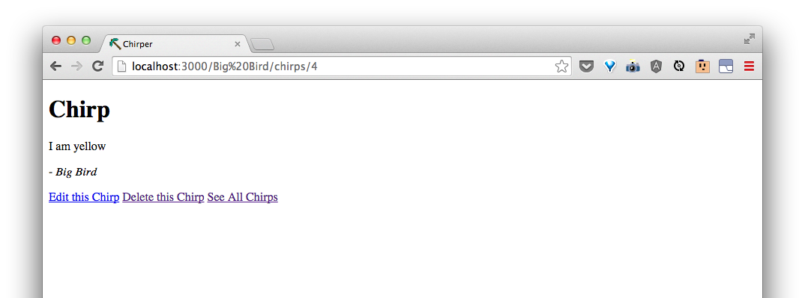

<!-- Not sure we need this section... -->

# Show and edit a chirp by author

The information for showing and editing a chirp will be the same based on the parameters from the route.

| URI Pattern | Controller #Action | What-should-it-do? | Example action code |
| -- | -- | -- | -- |
| /:author/chirps/:id | **chirps#show** | Show a chirp from an author | `Chirp.find_by(author: 'some author', id: 'id')` |
| /:author/chirps/:id/edit | **chirps#edit** | Show a form for editing an existing chirp from an author | `Chirp.find_by(author: 'some author', id: 'id')` |


Let's update the **chirps#show** and **chirps#edit** actions:

```rb
  def edit
    @chirp = Chirp.find_by(params.permit(:author, :id))
  end

  def show
    @chirp = Chirp.find_by(params.permit(:author, :id))
  end
```


We will see the same things as before for showing and editing a chirp.


