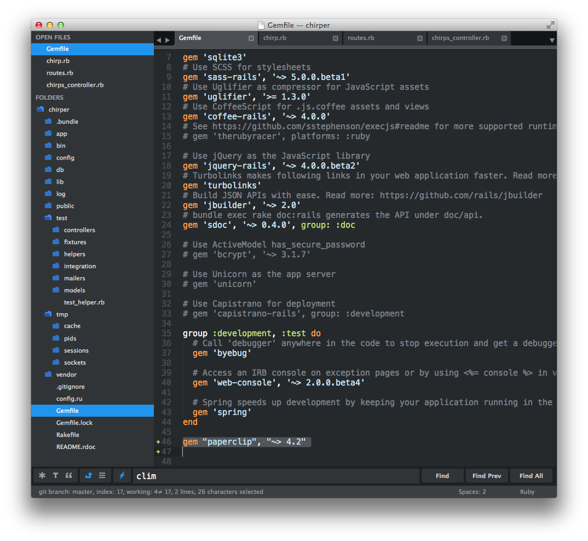
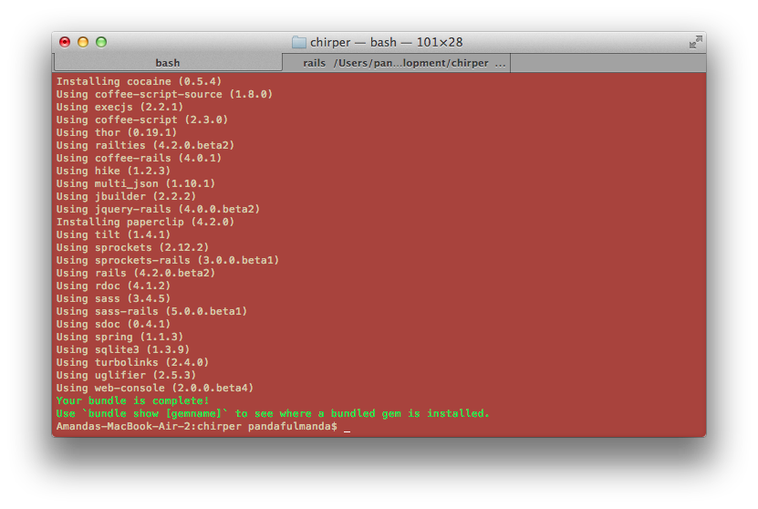

# What if I want to Chirp images?

We are going to need some outside help for this one! In order to chirp our latest cat images, we'll need to use a new `gem`.

> `gems` are packages of code that are ready for anyone working on a Rails project to use.  Ask your coach what `gems` they use day-to-day.

## Adding Paperclip

Let's add the `gem` Paperclip to our project. First, we need to open our `Gemfile` and add to the bottom:

```rails
gem "paperclip", "~> 4.2"
```



Save the `Gemfile`.  The `Gemfile` tells Rails what `gems` we need, but we still need to tell Rails to install them.

The Rails server needs to be restarted to install `gems`.  So, we can go to the command prompt tab where the server is running, and do the following:

1. Press `Ctrl` + `c` to stop the server.
2. Run `bundle install`. Bundler is now installing Paperclip into our project.

3. Start the server again with `rails server`.


> While Paperclip is installing, let's talk with our coach about the `Gemfile`,  and `bundler`.

