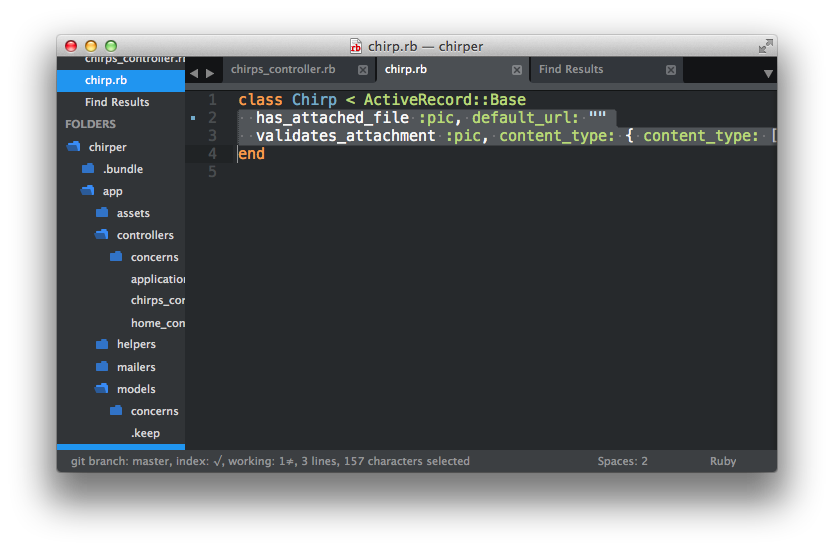

# Add Pic to Chirp Model

Now we need to let Rails know that our chirps can have images. Let's open the chirp `model` at `app/model/chirp.rb` and add the pic property:

```rails
has_attached_file :pic, default_url: "/images/:style/missing.png"
```
right after the first line.



## Telling Rails about our Chirp Pic

Now that we've added the property to our `model`, we'll need to build a migration to describe our new property. Lucky for us, the developers of Paperclip realized that every developer would need to take this step so all we need to do is type in the command line:

```bash
$ rails generate paperclip chirp pic
```

We'll then see:


If we go to [http://localhost:3000/chirps](http://localhost:3000/chirps), we'll see:


We've seen this before! In Chapter 4 we fixed this by typing:

```bash
$ rake db:migrate
```

in our command line to tell rails to migrate the new property into our chirp `model`. If we do this again and refresh our browser, we'll see our chirps page again.


