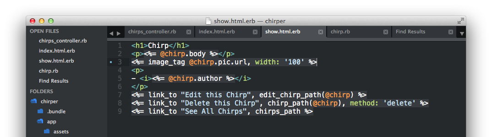
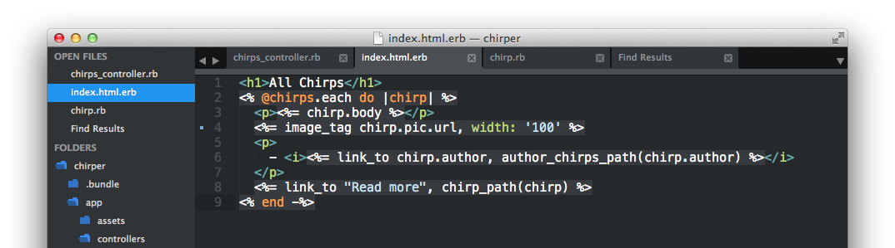
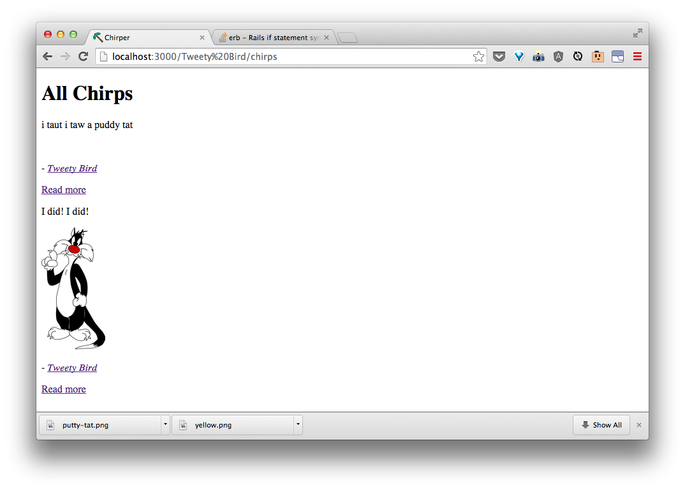

## Permitting Pic in the Chirp `Controller`

We'll need to tell Rails that we allow editing of the newly added pic property. Lets open `app/controllers/chirps_controller.rb` and add `:pic` to both the **chirps#create** and **chirps#update** actions like in the highlighted code below:


## New Chirps with Pics

Now that the controller has permission to change or add a pic, we'll need to add a way to upload a file. Let's open up `app/views/chirps/new.html.erb` and add:

```html
  <div>
    <%= f.label :pic %>
    <%= f.file_field :pic %>
  </div>
```
after the body field.


Now when you go to [http://localhost:3000/chirps/new], you'll see:


Add the same code to `app/views/chirps/edit.html.erb`


and at [http://localhost:3000/chirps/3/edit](http://localhost:3000/chirps/3/edit), you'll then see:


## Viewing Our Pics

After we've uploaded a new chirp with an image, we'll want to see it. First let's add:

```html
<p><%= image_tag @chirp.pic.url, width: '100' %></p>
```
to `app/views/chirps/show.html.erb`.



Now when you upload a chirp, you'll see:


Repeat for `app/views/chirps/index.html.erb` with:

```html
  <p><%= image_tag chirp.pic.url, width: '100' %></p>
```



and you'll now see:


