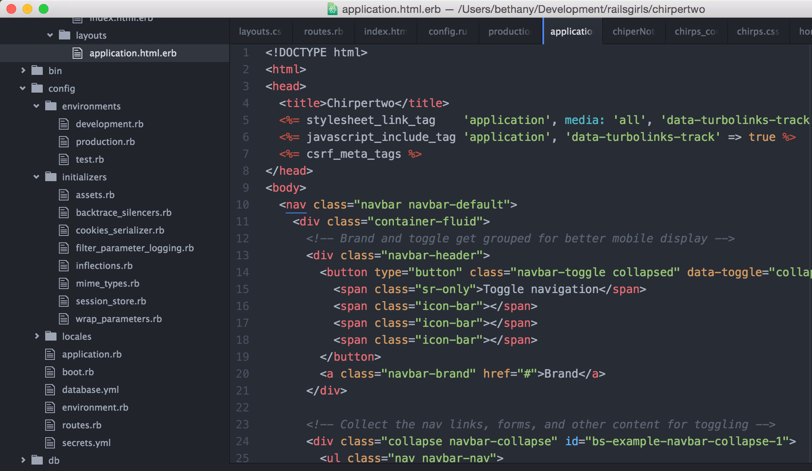

# Let's change how Chirper looks

Now that we've installed Bootstrap, we can make even more changes to the way our page uses using Bootstrap's classes.

We can check out Bootstrap's styles here:

[https://getbootstrap.com/css/](https://getbootstrap.com/css/)

Let's add navigation, so we can see what pages are available.

We can see that Bootstrap has already put together a navbar we can use. We can take a look at the navbar components they have made here:

[https://getbootstrap.com/components/#navbar](https://getbootstrap.com/components/#navbar)

Let's use their default navbar:

```html
<nav class="navbar navbar-default">
  <div class="container-fluid">
    <!-- Brand and toggle get grouped for better mobile display -->
    <div class="navbar-header">
      <button type="button" class="navbar-toggle collapsed" data-toggle="collapse" data-target="#bs-example-navbar-collapse-1" aria-expanded="false">
        <span class="sr-only">Toggle navigation</span>
        <span class="icon-bar"></span>
        <span class="icon-bar"></span>
        <span class="icon-bar"></span>
      </button>
      <a class="navbar-brand" href="#">Brand</a>
    </div>

    <!-- Collect the nav links, forms, and other content for toggling -->
    <div class="collapse navbar-collapse" id="bs-example-navbar-collapse-1">
      <ul class="nav navbar-nav">
        <li class="active"><a href="#">Link <span class="sr-only">(current)</span></a></li>
        <li><a href="#">Link</a></li>
        <li class="dropdown">
          <a href="#" class="dropdown-toggle" data-toggle="dropdown" role="button" aria-haspopup="true" aria-expanded="false">Dropdown <span class="caret"></span></a>
          <ul class="dropdown-menu">
            <li><a href="#">Action</a></li>
            <li><a href="#">Another action</a></li>
            <li><a href="#">Something else here</a></li>
            <li role="separator" class="divider"></li>
            <li><a href="#">Separated link</a></li>
            <li role="separator" class="divider"></li>
            <li><a href="#">One more separated link</a></li>
          </ul>
        </li>
      </ul>
      <form class="navbar-form navbar-left" role="search">
        <div class="form-group">
          <input type="text" class="form-control" placeholder="Search">
        </div>
        <button type="submit" class="btn btn-default">Submit</button>
      </form>
      <ul class="nav navbar-nav navbar-right">
        <li><a href="#">Link</a></li>
        <li class="dropdown">
          <a href="#" class="dropdown-toggle" data-toggle="dropdown" role="button" aria-haspopup="true" aria-expanded="false">Dropdown <span class="caret"></span></a>
          <ul class="dropdown-menu">
            <li><a href="#">Action</a></li>
            <li><a href="#">Another action</a></li>
            <li><a href="#">Something else here</a></li>
            <li role="separator" class="divider"></li>
            <li><a href="#">Separated link</a></li>
          </ul>
        </li>
      </ul>
    </div><!-- /.navbar-collapse -->
  </div><!-- /.container-fluid -->
</nav>
```

We have a special file in views that lets us add html that changes all our pages. Let's paste that html after our `<body>` tag in `app/views/layouts/application.html.erb`.



Now we can go to any of our pages, and we should be able to see our navbar at the top of the screen. Check it out:

[http://localhost:3000/](http://localhost:3000/)

[http://localhost:3000/chirps/new](http://localhost:3000/chirps/new)

Let's customize it! We can change

```html
<a class="navbar-brand" href="#">Brand</a>``` to

```html
<a class="navbar-brand" href="/">Chirper</a>```

Let's make a link to add a chirp:

```html
<li class="active"><a href="#">Link <span class="sr-only">(current)</span></a></li>``` to

```html
<li class="active"><a href="chirps/new">Make a Chirp<span class="sr-only">(current)</span></a></li>```

We can also add a link to all our chirps by changing the next line
```html
<li><a href="#">Link</a></li>``` to

````html
<li><a href="/chirps">Read a Chirp</a></li>```

Now when we go to [http://localhost:3000/](http://localhost:3000/) we should see


In the future, we may want to add a way to sign up and manage an account.

Let's change **Link** to **Sign Up** and **Dropdown** to **Login**.
```html
<li><a href="#">Link</a></li>
        <li class="dropdown">
          <a href="#" class="dropdown-toggle" data-toggle="dropdown" role="button" aria-haspopup="true" aria-expanded="false">Dropdown <span class="caret"></span></a>```

Since we're not using it, let's delete the first dropdown. We can remove this block of html, and our navbar will still work.

```html
<li class="dropdown">
  <a href="#" class="dropdown-toggle" data-toggle="dropdown" role="button" aria-haspopup="true" aria-expanded="false">Dropdown <span class="caret"></span></a>
  <ul class="dropdown-menu">
    <li><a href="#">Action</a></li>
    <li><a href="#">Another action</a></li>
    <li><a href="#">Something else here</a></li>
    <li role="separator" class="divider"></li>
    <li><a href="#">Separated link</a></li>
    <li role="separator" class="divider"></li>
    <li><a href="#">One more separated link</a></li>```

Let's go to `app/assets/stylesheets/application.css.scss` and add

```css
  body {
   background-color: #7bb9d0;
 }
```
under our import statements

Now when we go to our page, we will see the background color has changed!


We can also change our page's font. We can use the Google Fonts API to source fonts that are freely available on the web. Check them out here:

[https://www.google.com/fonts](https://www.google.com/fonts)

Let's use Raleway to test it out. We can add this line of html to `app/views/layouts/application.html.erb` in the head of our file:

```html
<link rel="stylesheet" type="text/css" href="http://fonts.googleapis.com/css?family=Raleway">```


Now we just need to define where we will be using Raleway. Let's return to to `app/assets/stylesheets/application.css.scss` and include a font specification for the body of our page:

```css
  body {
   font: 150% 'Raleway', serif;
   background-color: #7bb9d0;
 }
```

We can reload `http://localhost:3000` to view how our font has changed.

Right now, if we go to `http://localhost:3000/chirps` our chirps are aligned to the left of our page. Let's get them in the center.

We can go to `app/views/layouts/application.html.erb` and add

```html
  <div class="row">
    <div class="col-md-offset-3 col-md-6">
      <%= yield %>
    </div>
  </div>
```
at the end of the page after the `/nav` tag.


Now when we reload `http://localhost:3000/chirps` we can see that the pages elements are in a container in the middle of the page. Because we changed our application.html.erb file, all of our pages will have these changes applied.

Next, we can go to `app/views/chirps/index.html.erb` and add some div classes we can style and include some html elements. Let's change the file to this:

```html
<div class="chirpBackgroundBox">
  <h1>All Chirps</h1>
  <% @chirps.each do |chirp| %>
    <div class="row">
      <div class="col-md-12">
        <div class="chirpBox">
          <p><%= chirp.body %></p>
          <%= image_tag chirp.pic.url, width: '100' %>
          <p class="text-left">
            - <i><%= link_to chirp.author, author_chirps_path(chirp.author) %></i>
          </p>
          <br>
          <p class="text-right">
            <%= link_to "Read more", chirp_path(chirp) %>
          </p>
        </div>
      </div>
    </div>
  <% end -%>
</div>
```

`text-left` and `text-right` are typography classes we can give to text to align it.

Our chirp background box will create a box around our chirps, and the chirp box will style each chirp. Now, we can go to application.css.scss and add

```css
 div .chirpBackgroundBox {
   background-color: #e3e3e3;
   padding: 1em;
   border-radius: .5em;
 }
 ```


Now that we have our elements centered and a background, we can style the inner box displaying our chirps. We can add

```css
 div .chirpBox {
   font: 300%;
   margin: .75em;
   padding: 1.5em;
   background-color: #ededed;
   border-radius: .25em;
 }
 ```


> Experiment with different fonts and applying them to other parts of your page. Talk to your coach about `<%= yield %>`, bootstrap components, and how to include them.
