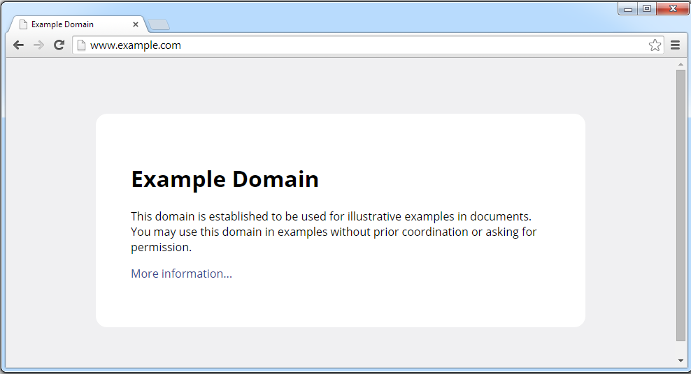

# How does the Internet work?

Whenever you go to watch a video on Youtube, check your wall on Facebook, run a search on Google, or even just use the Chirper app we're building a conversation occurs between two or more programs--sometimes, on two or more different computers, sometimes even on two or more continents!

## A simple exmaple ##

Open your browser, and go to http://www.example.com](http://www.example.com).

You should see a simple page which looks like this:



This is what happened behind the scenes:

1. Your computer looked up what **IP address** corresponds to "www.example.com" using a **DNS** lookup.
2. Your computer created a **TCP connection** to the server located at the address from step 1.
3. Your computer sent a message in the **HTTP** protocol to fetch the index page.
4. The server sent back the contents of the web page.
5. Your computer drew the web page onto your screen.

## Supporting Technologies ##

### IP: Addresses for Computers ###

Just as every building on a network of roads in a city has an address, so too does every computer on a network.

There are two types of addresses for computers: *IPv4* addresses, which look like `127.0.0.1` or `93.184.216.119`, and *IPv6* addresses, which look like `::1` or `2001:0:9d38:6ab8:34e7:1e37:3f57:ff99`. IPv4 is older and more widely deployed; IPv6 is what is used for new assignments.

IPv4 addresses are of the form `a.b.c.d`, where each component (called an *octect*) is a number between 0 and 255.

Whenever your computer is connected to a network (whether wirelessly or through a cable), it is assigned an IP address using *DHCP*.

### DNS: A Phonebook for the Web ###

When you want to call someone--at least until very recently!--you can't just holler their name into a phone: you've got to have a mapping from their name to their telephone number. If you don't know what their number is off the top of your head, then you check your phone. If your phone doesn't have that information, you ask a friend or check a phonebook.

In the same way, when you want to connect to a server for a website, you have to look up its IP address if you don't know it already. Your web browser does this every time you request a domain like `example.com` or `google.com`.

`localhost` is a special name which always corresponds to `127.0.0.1` (IPv4) or `::1` (IPv6); it is used to communicate to the same machine. When we connect with our browsers to the Chirper app we're developing, this is the address that we use.

Whenever you register a new domain name, you have to create so-called *DNS records*. These records provide the information for computers looking up your domain. The records you'll create are likely either going to be *A records* or *AAAA records*, which are used to map a domain name to an IPv4 or IPv6 address respectively, or *CNAME records*, which are used to alias one web address to another (say, aliasing `ftp.example.com` to point at the same thing as `files.example.com`).

### TCP: Connecting Two Computers on the Web ###

Once the browser has looked up the IP address for the website, it attempts to connect to that server over TCP. The server is "listening" for a connection, and will "accept" it if it is able. This connection will make sure that the web browser sees all the data requested arrive in order, and will do what it can to optimally use the network between the server and the client.

You might be wondering how a server can tell the differences between all of the clients talking to it, how it can keep from mixing up the data being sent to different clients. In addition to just keeping track of what the source IP address of the client is, it also tracks the *port* a client connected on and connected from.

A *port* in TCP is a sort of subaddress for a given IP address; if an IP address is like a street address, a port is like a room number within that builing.

Different services on servers and clients use different ports. Some ports are commonly used: port 80 is common for HTTP, and 443 is common for HTTPS. Our Rails app uses port 3000, picked to avoid conflicting with other services running on your system. It is possible to run multiple services of the same type on different ports--this can be useful, for example, for testing multiple related websites at the same time.

### HTTP: The Language of the Web ###

The Hypertext Transfer Protocol (**HTTP**) is the language used to communicate on the Internet. It isn't concerned with documents, images, videos, or anything themselves, but instead with the general problem of querying resources on a remote system.

Every HTTP request is written in plain text to a TCP connection, and looks like this:

```
GET /index.html HTTP/1.1
Host: www.example.com
Accept-Language: en-us
Accept-Encoding: gzip, deflate
User-Agent: Mozilla/4.0 (compatible; MSIE 6.0; Windows NT 5.1)
(blank line)
```

The first line is the request, asking the server to GET a resource (in our case, the index page).

All of the following lines are known as *HTTP headers*--these are just pairs of `key: value` lines that can be used to tell the server additional useful information about the request. Here, we say that the host we're seeking is `www.example.com` (useful for when the same machine hosts multiple domains), that the language we want is US English, that the encoding of the reply we'd like back can be compressed using two forms of zip files (to save bandwidth), and finally that the browser sending the request is Internet Explorer 6 (so that the server can decide to send us simpler web pages if it'd like).

Once this is sent, the reply we get back looks something like this:

```
HTTP/1.1 200 OK
Content-Type: text/html
Date: Fri, 24 Oct 2014 06:45:12 GMT
Expires: Fri, 31 Oct 2014 06:45:12 GMT
Last-Modified: Fri, 09 Aug 2013 23:54:35 GMT
Server: ECS (ftw/FBE8)
Content-Length: 1270
(blank line)
(bunch of HTML)
```

The first line is the repsonse, here declaring that the request was handled successfully (200 OK). There are many different status codes other than 200 you may expect back from a server: you've probably run into 403 (forbidden content), 404 (page not found), or even 500 (server is broken inside somewhere). Codes between 200 and 299 denote success, 300-399 denote redirection (perhaps a page has moved), 400-499 mean that the request is bad (badly formed, unauthorized, for something that doesn't exist, and so on), and 500-599 mean that while the request was valid the server was not able to process it.

The remaining lines are again headers using the same form as the request. These headers tell us that the content type returned is just HTML text (a web page), that the date on the server is today, that the content "expires" and should not be cached beyond Oct 31, that the content was modified most recently on the 9th of August, that the server is an ECS server (as opposed to Nginx, Apache, or Webrick), and finally that the content (after the blank line) will be 1270 bytes. This last header is important to get right, because it lets the client know when the data has finished being delivered.

Note that there are several other types of requests HTTP supports. *POST* is used to create a new resource on the server, or to send a form in for processing. *PUT* is used to partially update an existing resource (say, updating your billing information). *DELETE* is used to remove a resource. There are several other so-called *HTTP verbs*, which are documented extensively online. GET and POST are the most common.

## Additional resources ##

* [IPv4](http://en.wikipedia.org/wiki/IPv4) and [IPv6](http://en.wikipedia.org/wiki/IPv6) articles on Wikipedia
* [HTTP Made Really Easy](http://www.jmarshall.com/easy/http/) has a decent writeup about how the HTTP protocol works.
* Wikipedia also has an overiew of [HTTP](http://en.wikipedia.org/wiki/Hypertext_Transfer_Protocol).
* Wikipedia has a good list of [DNS record types](http://en.wikipedia.org/wiki/List_of_DNS_record_types).
* DNS Made Easy has an [explanation](http://help.dnsmadeeasy.com/spry_menu/cname-record/) of setting CNAME records.
* Wikipedia has a quite handy [list of HTTP status codes](http://en.wikipedia.org/wiki/List_of_HTTP_status_codes).
