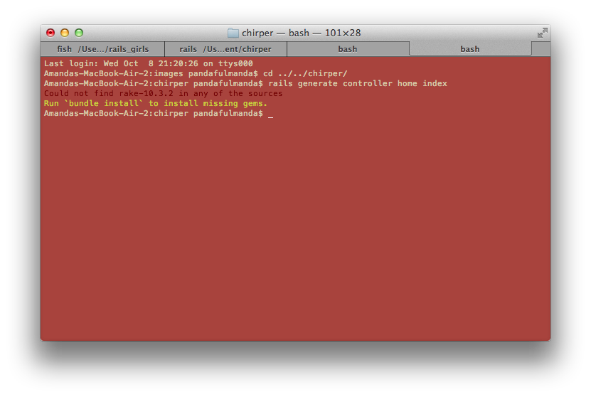
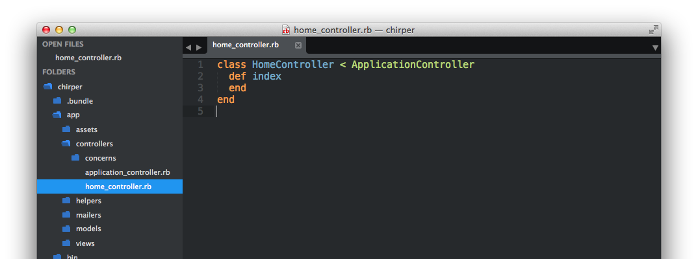
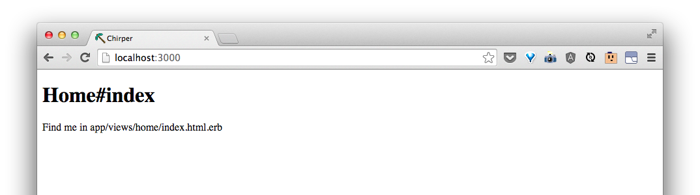
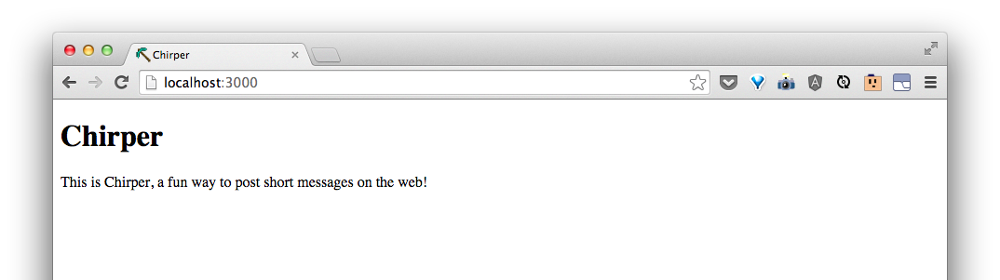

# Change the front page

Let's tell Rails to make an index page at our home for us.  Before we can tell it something new, we have to tell it to stop running the server by pressing `Ctrl + c`.

Then, we can tell it to make something:

```bash
$ rails generate controller home index
```

Sometimes, Rails will help you if you did something that doesn't work quite yet.  In this case, you may see something like this:



Let's do what it's telling us to do and type:

```bash
$ bundle install
```

Then, the commandline will say something like:


This means it is looking up for some packages called `gems` to download to your `chirper` folder so that you can use them!

When it's done, you'll see the `$ ` again.  If we press the up arrow, it will show us the last command we ran.  If we press up again, we should see:

```bash
$ rails generate controller home index
```

This time, Rails should know how do make the "`controller`".

You should see something like this:


<!--may need to edit out git init -->
<!--```bash-->
<!--      create  app/controllers/home_controller.rb-->
<!--       route  get 'home/index'-->
<!--      invoke  erb-->
<!--      create    app/views/home-->
<!--      create    app/views/home/index.html.erb-->
<!--      invoke  test_unit-->
<!--      create    test/controllers/home_controller_test.rb-->
<!--      invoke  helper-->
<!--      create    app/helpers/home_helper.rb-->
<!--      invoke    test_unit-->
<!--      invoke  assets-->
<!--      invoke    coffee-->
<!--      create      app/assets/javascripts/home.js.coffee-->
<!--      invoke    scss-->
<!--      create      app/assets/stylesheets/home.css.scss-->
<!--```-->

This means that Rails made some files for us!  Let's have a look in Sublime Text. If you open `app/controllers/home_controller.rb`, you should see:




Great!  Let's refresh our page in Chrome.


It looks like we've forgotten something.  We have to do`rails server` again so that there will be a page at this address. This can get annoying if we have to do keep starting the server and quitting the server to see changes.  So let's open a new terminal tab by pressing `cmd + t`.

Now do:

```bash
$ rails server
```
Now if you switch back to your first tab by clicking on it, you can run commands in this first tab while the server is still running.

Let's look at our page in Chrome again. It doesn't look like anything has changed from before.  That's because Rails doesn't know to point the index page to the new one we made.

In Sublime Text, go to `config/routes.rb`.  You should see something like this:


After where it says

```ruby
    get 'home/index'
```

type:

```ruby
    root to: 'home#index'
```

This will tell Rails to point the "`root`" of the site to the page we told Rails to make.

Now, if we go to Chrome, we should see something like:



Let's go find the file in `app/views/home/index.html.erb` like the page says!


That looks a lot like what's in the browser!  This is `html` with a touch of something called `erb`.  You can see that in the extension of the file, `.html.erb`.

> Ask your coach about `html` and `erb`.

> Go ahead and play around with the file.  Ask your coach for some different things to try. Refresh your page in Chrome to see it update.

For now, this is what I will do.

```html
<h1>Chirper</h1>
<p>This is Chirper, a fun way to post short messages on the web!</p>
```

My page now looks like this:



