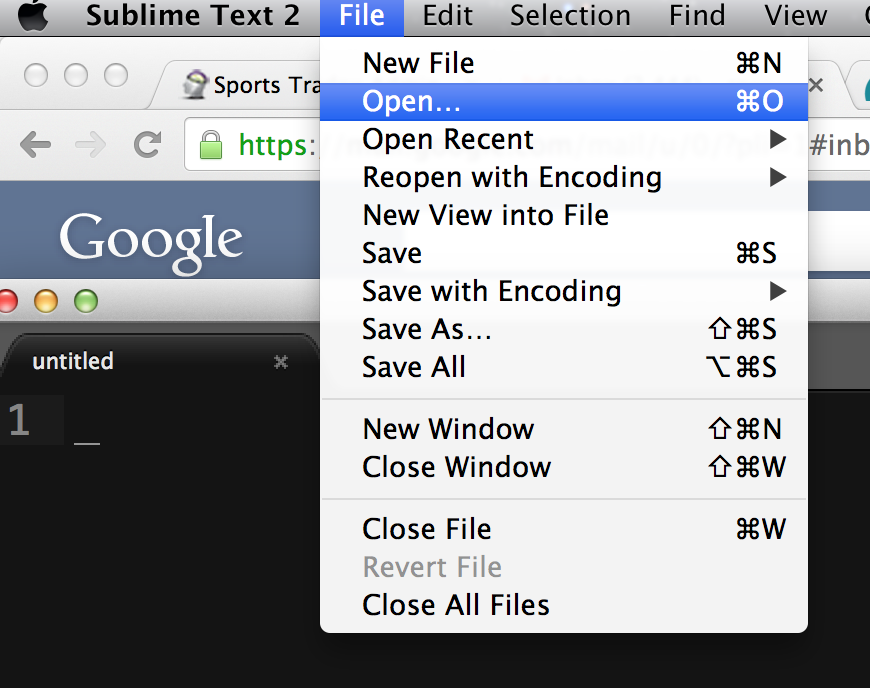
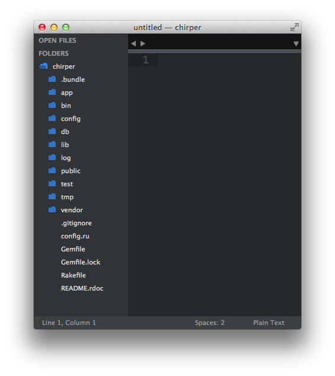
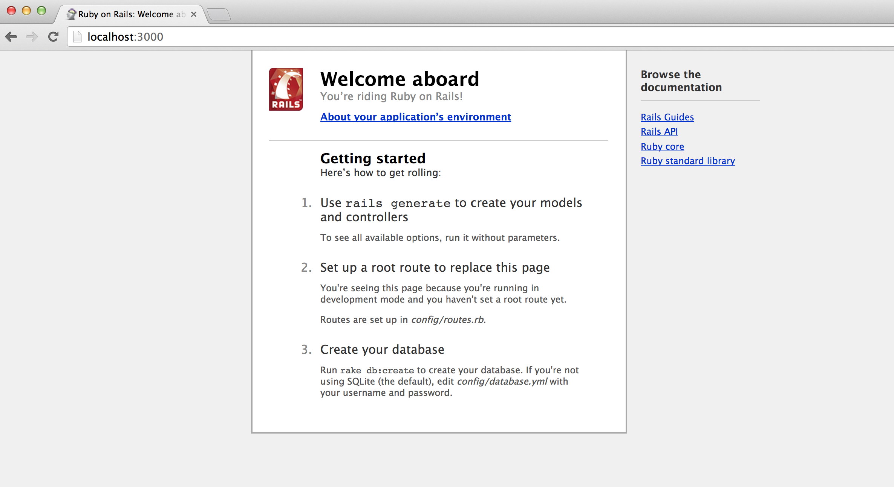

# Getting Started

Notice all the custom T-Shirt websites online? There are about 5 billion of them. So that is why we are going to create our own custom T-Shirt website. This sounds like a terific business opportunity. Let's call our site TEErific.

## Creating your Rails Applications

At the command prompt, we need to type the command.
~~~
$ rails new teerific
~~~

The command will generate all the files and folders you need for a Rails application. We will learn more about what the files do as we build our site.

## Opening the project in Sublime

Before we start the application, let's view the project in Sublime.

First we will click on File and then select Open.

Next, we will find the folder we just created with `rails new teerific`.

After we open the folder, we can see our Rails project structure in Sublime's project window.

## Starting our Rails Application

Time to start our Rails Application. Basically a quick test to see if we did everything right. :)

~~~
$ cd teerific
$ rails server
~~~

You should see something like the following in your terminal.

~~~
=> Booting WEBrick
=> Rails 4.0.0 application starting in development on http://0.0.0.0:3000
=> Run `rails server -h` for more startup options
=> Ctrl-C to shutdown server
INFO  WEBrick 1.3.1
INFO  ruby 1.9.3 (2012-12-25) [x86_64-darwin12.2.1]
INFO  WEBrick::HTTPServer#start: pid=91441 port=3000
~~~

If you go to a web browser like Chrome, you can view your website at `http://localhost:3000`

