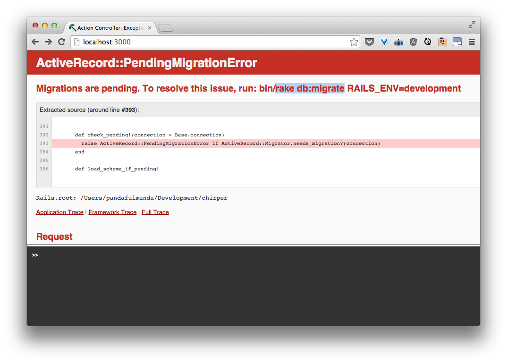
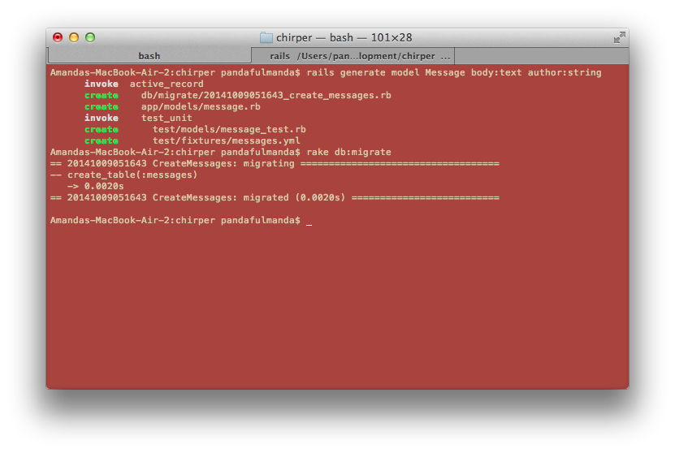

# What should messages have and do?

> What does a message need to have?
>
> Let's discuss!
>
> For example, a message should have an author, a message body...what are some other things?
>
> What do we need to be able to do with a message?  For example, we need to be able to make new ones.


## Let's tell Rails our definition of messages!

Let's command Rails to work with these kinds of messages:

```bash
$ rails generate model Message body:text author:string
```

Rails will now make something called a "`model`" to represent this idea of a Message.  With a "`model`", Rails can associate different actions to do with Messages, and can save different Messages we'll be making to a *database*.

> Discuss more with your coach about what a "`model`" is and what a *database* does.

Our commandline should now look like this:


Just like before when we did `rails generate controller ...`, Rails has made some new files for us.

Let's refresh our page and see if anything changed.



Ouch, an error!  But once again, Rails guides us by telling us what to do to fix the problem.  Here, I've highlighted the important part we should run in our commandline:

```bash
$ rake db:migrate
```

What we are doing is telling `rake` to "migrate" the new information we've made about how Messages are structured into the database.

Now, we should see this in our terminal:



<!--I just made this up so I actually need to research this a little more-->
> *ActiveRecord* is a really neat thing that actively keeps a record of all the changes our database is going through.  In case something goes wrong, or you are trying to share the same database structure and information with someone, *ActiveRecord* will be able to "migrate" you whatever state it has a record of.
>
> Discuss more in depth with your coach what *ActiveRecord* and `rake` are.

Now, if we reload our page in Chrome, we should see our expected index page again.

It works again, but it doesn't seem like anything has changed.  That is fine.  We need to be able to perform some actions on Messages first.  While we don't have any Messages right now,if we *add*, *edit*, or *update* a Message, we need to be able to *view* them in order to know that anything worked.

Let's start with building a way to *view all messages*.
