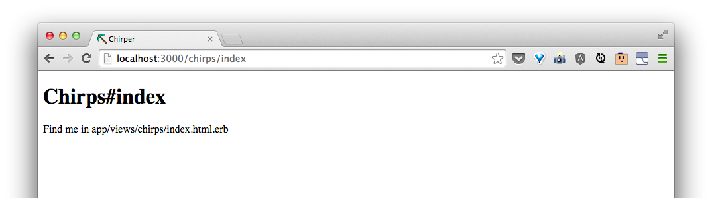

# Viewing all messages

To view all chirps, let's make a new `controller` specficially to handle things to do with chirps.

We can do this the same way we commanded Rails to do this for the front page in the commandline:

```bash
$ rails generate controller Chirps index
```


Now, if we go to [http://localhost:3000/chirps/index](http://localhost:3000/chirps/index), we should see a new page.



<!--Once again, if we look in `config/routes.rb`, we'll see that Rails has updated the instructions to match when we go to [http://localhost:3000/chirps/index](http://localhost:3000/chirps/index),-->

<!---->


Next, we need a way to tell the page about all our chirps.  In Rails, we tell our pages information through the "`controller`."  Let's go to the controller for the chirps page at `app/controllers/chirps_controller.rb` and give the page information about all our chirps.

Looking at what's there right now, we should see:


Between `def index` and `end`, we tell the page

```ruby
    @chirps = Chirp.all
```


<!--By default, when Rails adds a route for us each time we make a new controller, the route `chirps/index` will look at the chirps' controller for the index function (the code between `def index` and `end`).-->

<!--\> Discuss what a function in Ruby looks like. -->

